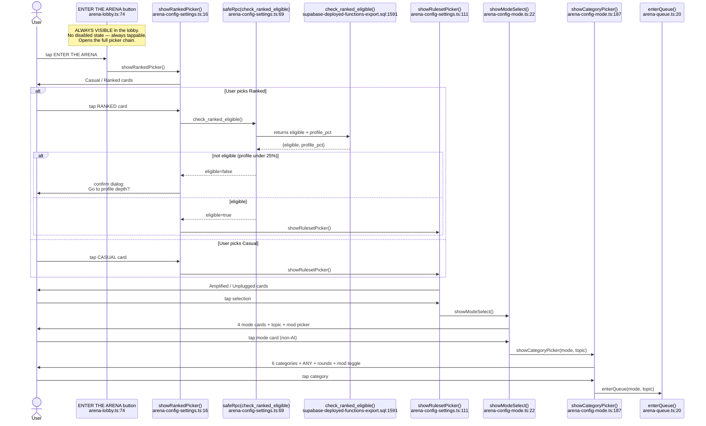
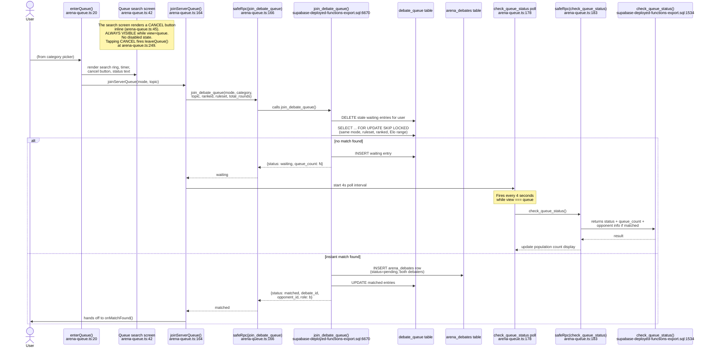
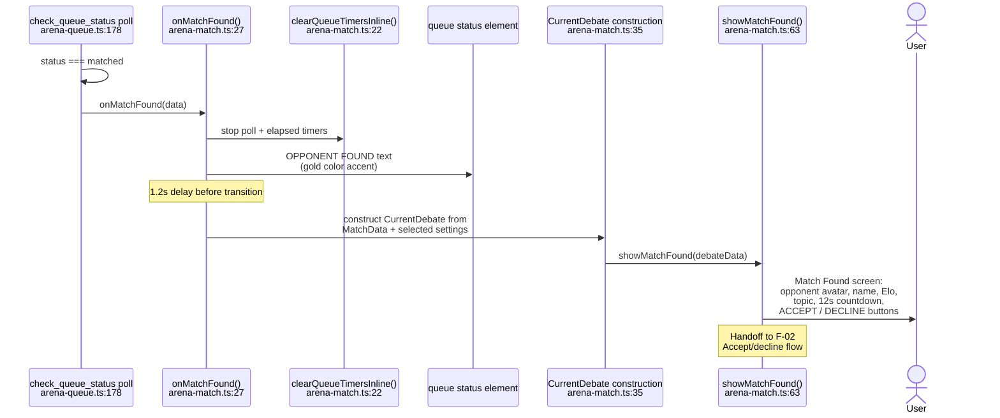
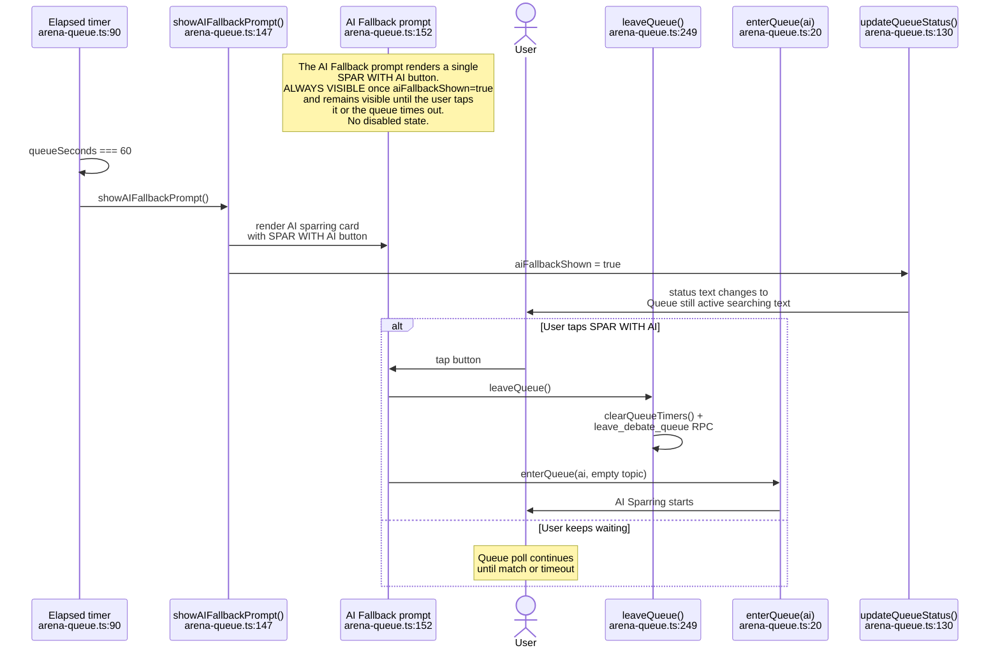
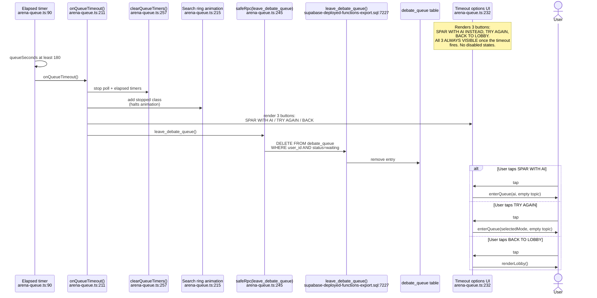

# F-01 — Waiting Room — Interaction Map

## Summary

The Waiting Room is the queue and matchmaking system for human-vs-human debates. Users enter via the ENTER THE ARENA button in the lobby, configure their debate through a 4-step picker chain (ranked/casual → ruleset → mode → category), and land in a search screen that polls for opponents every 4 seconds. The queue uses a 2-phase matching algorithm: strict (same mode, same category, Elo within 400) then loose (same mode, any category). If no match is found within 60 seconds, an AI Sparring fallback prompt appears; at 180 seconds, the queue hard-times-out with final options. All queue logic lives in `src/arena/arena-queue.ts` (261 lines), the configuration pickers in `src/arena/arena-config-settings.ts` and `src/arena/arena-config-mode.ts`, and the match handoff in `src/arena/arena-match.ts`. The lobby rendering including the ENTER THE ARENA button is in `src/arena/arena-lobby.ts`. The core queue RPCs (`join_debate_queue`, `check_queue_status`, `leave_debate_queue`) are deployed as SECURITY DEFINER functions. Three overloaded versions of `join_debate_queue` exist in the deployed export (4-param, 5-param, 6-param); the client calls the 6-param version. Feature shipped across Sessions 167–170 (Layer 1: queue screen, Layer 2: population count + spectator feed, Layer 3: category-scoped queues with backoff).

## User actions in this feature

1. **User configures debate settings** — ENTER THE ARENA → ranked/casual → ruleset → mode → category picker chain
2. **User enters the queue and searches** — queue screen renders, `join_debate_queue` fires, 4-second poll starts
3. **Queue finds a match** — instant match on join or via poll → hands off to Match Found screen (F-02)
4. **AI Sparring fallback at 60 seconds** — prompt appears, user can switch to AI or keep waiting
5. **Queue times out at 180 seconds** — hard timeout, final options presented

---

## 1. User configures debate settings

The ENTER THE ARENA button at `arena-lobby.ts:74` fires `showRankedPicker()` from `arena-config-settings.ts:16` on click (`arena-lobby.ts:120`). The picker chain is: Ranked/Casual → Ruleset (Amplified/Unplugged) → Mode Select → Category Picker. Each step is a bottom-sheet overlay that pushes browser history state.

The Ranked card at `arena-config-settings.ts:43` triggers a server-side eligibility check via `check_ranked_eligible` RPC (`arena-config-settings.ts:69`). If the user's profile is below 25%, a `confirm()` dialog offers to redirect to the profile depth page. On selection, `showRulesetPicker()` at `arena-config-settings.ts:111` presents Amplified vs Unplugged. Then `showModeSelect()` at `arena-config-mode.ts:22` renders the 4 mode cards (Moderated Live, Voice Memo, Text Battle, AI Sparring) plus a topic input and moderator picker. Selecting a non-AI mode routes to `showCategoryPicker()` at `arena-config-mode.ts:187`, which renders 6 category buttons plus an ANY CATEGORY option, a round picker, and a "Request a moderator" checkbox. Picking a category calls `enterQueue()`.

**Notes:**
- AI Sparring mode bypasses the category picker entirely — `showModeSelect()` at `arena-config-mode.ts:97` calls `enterQueue('ai', topic)` directly and forces ruleset to `amplified` (`arena-config-mode.ts:98`).
- The "Request a moderator" checkbox at `arena-config-mode.ts:226` sets `selectedWantMod` state. If true, `request_mod_for_debate` is called after both players accept the match (`arena-match.ts:170`), making the debate visible in F-47's Mod Queue.
- LM-128: `check_ranked_eligible` at `supabase-deployed-functions-export.sql:1591` returns `{eligible, profile_pct}`. The 25% threshold is enforced server-side.
- Each picker pushes browser history via `pushArenaState()`, so the back button navigates through the picker chain without re-rendering the lobby.

---

## 2. User enters the queue and searches

`enterQueue()` at `arena-queue.ts:20` sets the view to `queue`, renders the search screen with a spinning ring animation, timer, status text, cancel button, and spectator feed. For non-placeholder mode, it calls `joinServerQueue()` at `arena-queue.ts:164`, which fires `join_debate_queue` with all 6 parameters (mode, category, topic, ranked, ruleset, total_rounds).

The RPC at `supabase-deployed-functions-export.sql:6670` clears stale waiting entries for the user, then attempts matching: it searches `debate_queue` for a waiting entry with the same mode, same ruleset, same ranked flag, and Elo within 400 points, using `FOR UPDATE SKIP LOCKED` for race safety. If a match is found, it inserts an `arena_debates` row and returns status `matched`. If not, it inserts a `debate_queue` row with status `waiting` and returns status `waiting` plus a `queue_count` of others searching.

When the RPC returns `waiting`, the client starts a 4-second poll (`arena-queue.ts:178`) calling `check_queue_status`. The poll also updates the queue population count display at `arena-queue.ts:189`. A 1-second elapsed timer (`arena-queue.ts:90`) drives the status text progression at `arena-queue.ts:130`: "Searching..." → "Expanding search range..." → "Searching all regions..." → "Still looking...".

**Notes:**
- LM-009: The `debate_queue` table has a unique constraint (`idx_queue_one_waiting`) allowing only one waiting entry per user. The RPC handles this by deleting stale entries first at `supabase-deployed-functions-export.sql:6694`.
- LM-126: Three overloaded versions of `join_debate_queue` exist in the deployed functions export (lines 6553, 6670, 6812). The client calls the 6-param version. The 4-param version is legacy.
- The spectator feed in the queue screen (`arena-queue.ts:63`) is fire-and-forget — it calls `get_arena_feed` to show live debates while the user waits. B-09 fix: if category filter returns empty, it falls back to a general feed (`arena-queue.ts:71`).
- The `_queuePollInFlight` guard at `arena-queue.ts:180` prevents overlapping poll requests if a previous one is slow.
- The poll catch block at `arena-queue.ts:198` is empty: `catch { /* handled */ }`. This silently swallows errors during polling — the user gets no indication of network issues.
- LM-200: When a match is found, the `arena_debates` INSERT triggers `stamp_debate_language`, which stamps the debate creator's language preference from `profiles.preferred_language`.

---

## 3. Queue finds a match

When `check_queue_status` returns `status === 'matched'` during polling, or when `join_debate_queue` returns `matched` immediately, the client calls `onMatchFound()` at `arena-match.ts:27`. This clears the queue timers, shows a "OPPONENT FOUND!" status message, then after a 1.2-second delay constructs a `CurrentDebate` object and routes to either `enterRoom()` (for AI mode) or `showMatchFound()` (for human opponents).

`showMatchFound()` at `arena-match.ts:63` renders the Match Found screen with opponent name, Elo, topic, a 12-second countdown, and ACCEPT/DECLINE buttons. This is the F-02 boundary — the accept/decline flow, `respond_to_match` RPC, and `check_match_acceptance` polling all belong to F-02.

**Notes:**
- The matched user who joined second (role `b`) gets opponent info from the `join_debate_queue` return. The first user (role `a`) gets opponent info from `check_queue_status` at `supabase-deployed-functions-export.sql:1555`.
- `check_queue_status` always returns `role: 'a'` for the polling user at `supabase-deployed-functions-export.sql:1581`. This is correct — the first user in queue is always debater A.
- The 1.2-second delay at `arena-match.ts:34` is intentional — it gives the "OPPONENT FOUND!" message time to display before the transition.
- If `selectedWantMod` is true, `request_mod_for_debate` is called after both players accept (in `onMatchConfirmed()` at `arena-match.ts:170`), not at match-found time. This means the debate enters F-47's Mod Queue only after both debaters have committed.

---

## 4. AI Sparring fallback at 60 seconds

At 60 seconds (configurable per mode via `QUEUE_AI_PROMPT_SEC` at `arena-types.ts:363`), `showAIFallbackPrompt()` at `arena-queue.ts:147` renders a fallback card with a "SPAR WITH AI" button. Clicking it calls `leaveQueue()` then `enterQueue('ai', '')`, switching the user to an AI Sparring match. The queue continues running in the background until the user acts — the AI prompt is additive, not a takeover.

**Notes:**
- The `aiFallbackShown` flag at `arena-queue.ts:148` prevents the prompt from re-rendering. Once shown, it stays visible until the user acts or the queue times out.
- AI fallback is disabled for AI mode itself: `QUEUE_AI_PROMPT_SEC` is 0 for `ai` mode (`arena-types.ts:363`).
- The status text changes to "Queue still active — searching..." when the fallback is shown (`arena-queue.ts:135`), reassuring the user the queue hasn't stopped.

---

## 5. Queue times out at 180 seconds

At 180 seconds (configurable per mode via `QUEUE_HARD_TIMEOUT_SEC` at `arena-types.ts:364`), `onQueueTimeout()` at `arena-queue.ts:211` fires. It clears all timers, stops the search ring animation, changes the status to "No opponents available right now," clears the AI prompt, and renders three final options: SPAR WITH AI INSTEAD, TRY AGAIN, and BACK TO LOBBY. It also fires `leave_debate_queue` to clean up the server-side queue entry.

**Notes:**
- The hard timeout is 180 seconds for all human modes and 0 for AI mode (AI never queues — it starts immediately).
- `leave_debate_queue` at `supabase-deployed-functions-export.sql:7227` is a simple `DELETE FROM debate_queue WHERE user_id AND status = 'waiting'`.
- The `leaveQueue()` function at `arena-queue.ts:249` (used by the CANCEL button) and `onQueueTimeout()` both call `leave_debate_queue`, but `leaveQueue()` also calls `renderLobby()` directly.
- The `leave_debate_queue` RPC call is fire-and-forget with `.catch()` at `arena-queue.ts:245` — if it fails, the server-side queue entry will be stale until the user re-enters (at which point `join_debate_queue` cleans it up).

---

## Cross-references

- [F-02 Match Found](./F-02-match-found.md) — the accept/decline screen. F-01's `onMatchFound()` hands off to `showMatchFound()`, which is F-02's entry point. F-02 handles `respond_to_match`, `check_match_acceptance`, countdown, and the transition to the debate room.
- [F-46 Private Lobby](./F-46-private-lobby.md) — shares the lobby UI. The PRIVATE DEBATE button and join-code input in the lobby route to F-46's picker flow. Private lobbies bypass the queue entirely via `create_private_lobby`.
- [F-47 Moderator Marketplace](./F-47-moderator-marketplace.md) — the MOD QUEUE button at `arena-lobby.ts:81` and moderator recruitment banner at `arena-lobby.ts:82` live in the lobby. The "Request a moderator" checkbox in the category picker triggers `request_mod_for_debate` after match acceptance.
- [F-48 Mod-Initiated Debate](./F-48-mod-initiated-debate.md) — mod-created debates use `arena_debates` table but bypass the queue entirely. Debaters join via join code, not matchmaking.
- [F-49 Guest AI Sparring](./F-49-go-guest-sparring.md) — separate from the queue's AI fallback. F-49 is the standalone `/go` page; the queue's AI prompt at 60s calls `enterQueue('ai', '')` which uses `startAIDebate()` from `arena-match.ts:198`.

## Known quirks

- **Three overloaded `join_debate_queue` functions in deployed export.** Lines 6553 (4-param legacy), 6670 (6-param current), and 6812 (5-param intermediate). The client calls the 6-param version. The others are legacy overloads that were never dropped. PostgreSQL resolves by parameter count, so they coexist without conflict, but the 4-param version hardcodes `total_rounds = 3` at `supabase-deployed-functions-export.sql:6612` vs the 6-param version's configurable rounds — if somehow called, debates would get the wrong round count.
- **Queue poll catch block silently swallows errors.** At `arena-queue.ts:198`, `catch { /* handled */ }` means network failures during polling produce no user feedback. The user sees a frozen timer and stale population count with no error indication.
- **Spectator feed catch block silently swallows errors.** At `arena-queue.ts:87`, `catch { /* feed is optional */ }` means the "Live in the Arena" feed section may silently fail to load with no fallback message.
- **`check_queue_status` hardcodes `role: 'a'` at `supabase-deployed-functions-export.sql:1581`.** This is correct for the polling user (first into queue = debater A), but if the matching logic ever changes role assignment, this would silently produce wrong roles.
- **Category matching inconsistency between 4-param and 6-param `join_debate_queue`.** The 4-param version at line 6553 does 2-phase matching (strict category, then loose any-category). The 6-param version at line 6670 does only 1-phase matching (no category filter at all, just mode+ruleset+ranked). Category-scoped matching from the punch list's "Layer 3" appears to be in the 4-param legacy version, not the current 6-param version.
- **`onMatchFound` uses `selectedMode` state variable.** At `arena-match.ts:39`, if `selectedMode` is stale or null (e.g., after a page reload mid-queue), the `CurrentDebate` defaults to `text` mode. The RPC does not return the matched mode in the response.
