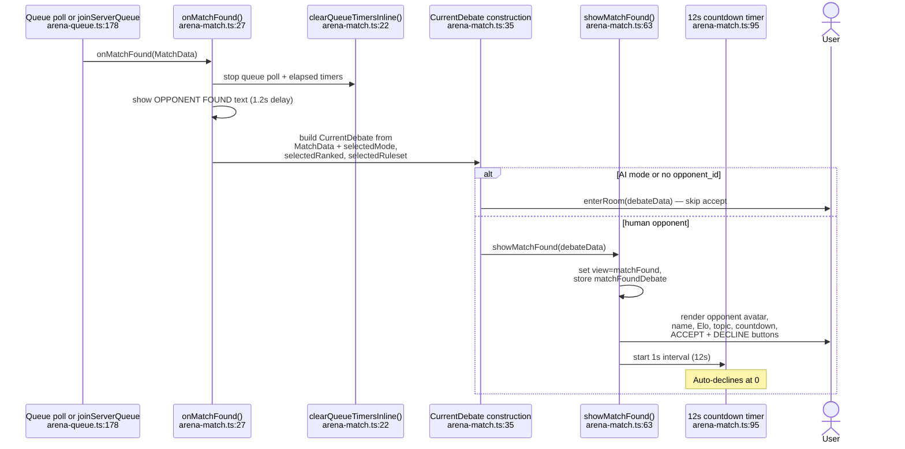
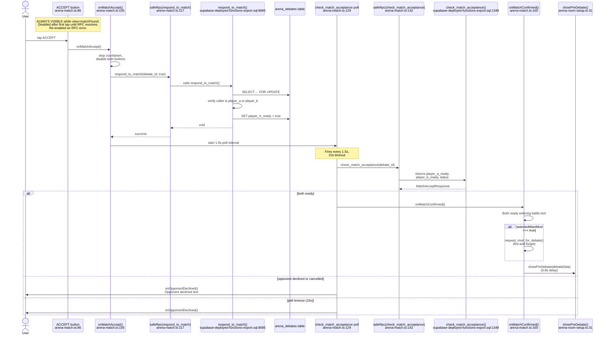
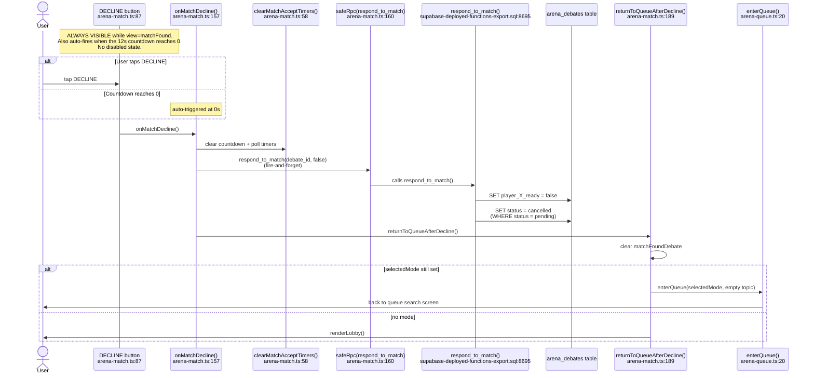

# F-02 — Match Found Accept/Decline Screen — Interaction Map

## Summary

The Match Found screen is the accept/decline gate between queue matching and entering a debate room. When F-01's queue finds an opponent (or F-46's private lobby gets joined), `onMatchFound()` constructs a `CurrentDebate` and calls `showMatchFound()`, which renders the opponent's avatar, name, Elo, topic, a 12-second countdown, and ACCEPT/DECLINE buttons. Accepting fires `respond_to_match(p_accept=true)` then starts a 1.5-second poll on `check_match_acceptance` waiting for the opponent's response. Both ready → enters pre-debate. Opponent declines → returns to queue. The entire feature lives in `src/arena/arena-match.ts` (222 lines). Two RPCs handle the server side: `respond_to_match` (sets `player_a_ready` or `player_b_ready` on `arena_debates`, cancels on decline) and `check_match_acceptance` (reads both ready columns + status). Feature shipped in Session 168, adding `player_a_ready` and `player_b_ready` columns to `arena_debates`.

## User actions in this feature

1. **Match found — screen renders** — `onMatchFound()` builds `CurrentDebate`, routes to `showMatchFound()`
2. **User accepts** — taps ACCEPT, sends `respond_to_match(true)`, polls for opponent
3. **User declines (or countdown expires)** — taps DECLINE or 12s timer hits zero, returns to queue

---

## 1. Match found — screen renders

`onMatchFound()` at `arena-match.ts:27` is the entry point, called from F-01's queue poll (`arena-queue.ts:196`) or from `joinServerQueue()` on instant match. It clears queue timers, shows "OPPONENT FOUND!" in gold, then after a 1.2-second delay constructs a `CurrentDebate` object from the `MatchData` + selected state (mode, ranked, ruleset). For AI mode or missing opponent ID, it skips directly to `enterRoom()`. For human opponents, it calls `showMatchFound()`.

`showMatchFound()` at `arena-match.ts:63` renders the match-found screen with the opponent's initial as an avatar, their name, Elo, the topic, a countdown starting at 12 seconds, and ACCEPT/DECLINE buttons. The countdown timer fires every second at `arena-match.ts:95` and auto-triggers `onMatchDecline()` when it reaches zero.

**Notes:**
- The `MATCH_ACCEPT_SEC` constant is 12 seconds (`arena-types.ts:375`).
- The countdown display at `arena-match.ts:98` updates the `mf-countdown` element every second.
- `matchFoundDebate` state (set at `arena-match.ts:65`) stores the `CurrentDebate` for use by accept/decline handlers.
- AI Sparring bypasses the accept screen entirely at `arena-match.ts:50` — this is by design per LM-190.

---

## 2. User accepts

The ACCEPT button at `arena-match.ts:86` fires `onMatchAccept()` at `arena-match.ts:105`. This stops the countdown, disables both buttons, shows "Waiting for opponent...", and calls `respond_to_match(p_debate_id, p_accept=true)`. The RPC at `supabase-deployed-functions-export.sql:8695` locks the debate row with `FOR UPDATE`, checks the caller is `player_a` or `player_b`, then sets the appropriate ready column. It's idempotent — second call is a no-op (checked at lines 8719/8722).

After accepting, the client starts a 1.5-second poll on `check_match_acceptance` at `arena-match.ts:129`. The poll reads `player_a_ready`, `player_b_ready`, and `status`. The client maps these based on the user's role (`arena-match.ts:149-150`): `role === 'a'` means my column is `player_a_ready`, opponent's is `player_b_ready`. When both are true, `onMatchConfirmed()` fires. If the opponent declines (`false`), or status becomes `cancelled`, `onOpponentDeclined()` fires. A 15-second poll timeout (`MATCH_ACCEPT_POLL_TIMEOUT_SEC` at `arena-types.ts:376`) also triggers the declined path.

**Notes:**
- LM-190: `respond_to_match` is idempotent — if `player_X_ready IS NOT NULL`, it returns early (no-op). This prevents double-accept race conditions.
- On RPC error, the accept handler re-enables both buttons and shows "Error — retrying..." at `arena-match.ts:119`.
- The poll's `_pollInFlight` guard at `arena-match.ts:139` prevents overlapping requests.
- The poll catch block at `arena-match.ts:153` is empty: `catch { /* retry next tick */ }`. Network failures during the accept poll produce no user feedback.
- `onMatchConfirmed()` fires `request_mod_for_debate` at `arena-match.ts:171` if `selectedWantMod` is true — this is how F-47's Mod Queue gets populated from queue-matched debates.

---

## 3. User declines (or countdown expires)

The DECLINE button at `arena-match.ts:87` fires `onMatchDecline()` at `arena-match.ts:157`. This clears all accept timers, sends `respond_to_match(debate_id, false)` as fire-and-forget, then calls `returnToQueueAfterDecline()`.

When the countdown reaches zero at `arena-match.ts:99`, it also calls `onMatchDecline()`, so a timeout is functionally identical to an explicit decline.

`respond_to_match(p_accept=false)` at `supabase-deployed-functions-export.sql:8727` sets the debate status to `cancelled` (WHERE status = 'pending' guard). This ensures the opponent's poll detects the cancellation.

`returnToQueueAfterDecline()` at `arena-match.ts:189` clears the `matchFoundDebate` state and re-enters the queue with `enterQueue(selectedMode, '')` if a mode is still selected, or returns to the lobby otherwise.

**Notes:**
- The decline RPC is fire-and-forget at `arena-match.ts:160`: `.catch((e) => console.warn(...))`. If it fails, the debate stays in `pending` with one player's ready column set to `true` — it will eventually be detected as stale.
- `onOpponentDeclined()` at `arena-match.ts:178` (triggered when the opponent declines first) disables both buttons, shows "Opponent declined — returning to queue...", then calls `returnToQueueAfterDecline()` after a 1.5-second delay.
- The auto-return-to-queue behavior at `arena-match.ts:191` is a nice UX touch — declining doesn't dump the user back to the lobby, it puts them right back into the search.
- LM-190 applies: the status guard `WHERE status = 'pending'` at `supabase-deployed-functions-export.sql:8728` means a cancel on an already-started debate is silently ignored.

---

## Cross-references

- [F-01 Queue / Matchmaking](./F-01-queue-matchmaking.md) — provides the `onMatchFound()` entry point. F-01's queue poll calls `onMatchFound()` which routes to `showMatchFound()`. After decline, `returnToQueueAfterDecline()` re-enters F-01's queue.
- [F-46 Private Lobby](./F-46-private-lobby.md) — private lobby matches also route through `showMatchFound()`. Private lobbies set `player_a_ready = true` at creation time, so only the joiner needs to accept.
- [F-47 Moderator Marketplace](./F-47-moderator-marketplace.md) — `onMatchConfirmed()` fires `request_mod_for_debate` if the user requested a moderator, making the debate visible in F-47's Mod Queue.

## Known quirks

- **Poll catch block silently swallows errors.** At `arena-match.ts:153`, `catch { /* retry next tick */ }` means the 1.5-second poll for opponent acceptance produces no error feedback on network failure. The user sees a frozen "Waiting for opponent..." message.
- **`request_mod_for_debate` is fire-and-forget after both accept.** At `arena-match.ts:171`, `.catch((e) => console.warn(...))`. If the RPC fails, the debate proceeds unmoderated with no indication to the user that their moderator request was lost.
- **Private lobby creator's `player_a_ready` is set at creation, not at match-found.** `create_private_lobby` sets `player_a_ready = true` at `supabase-deployed-functions-export.sql:3350`. This means the creator effectively auto-accepts. When the joiner enters via F-46, `check_match_acceptance` would show the creator already ready — but F-46 actually polls `check_private_lobby` instead of going through F-02's full accept flow.
- **Countdown timer doesn't account for accept RPC latency.** The countdown stops on ACCEPT click at `arena-match.ts:106`, but if the RPC takes several seconds and then fails, the user has already burned some of their 12-second window. The buttons re-enable on error, but the countdown doesn't restart.
