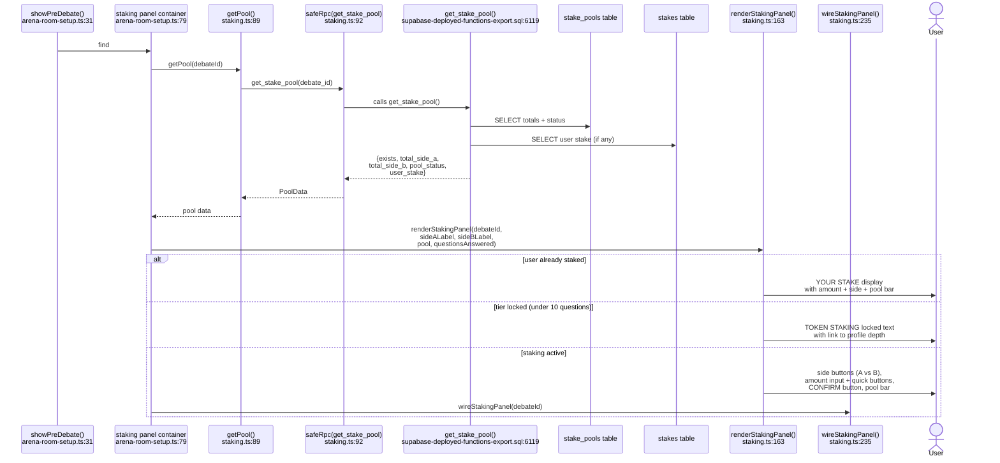
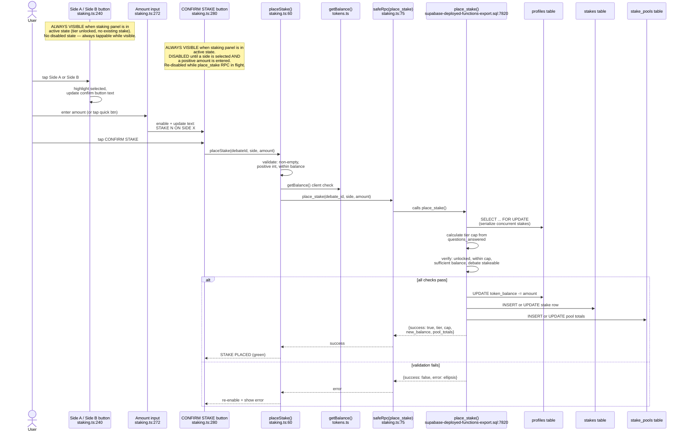
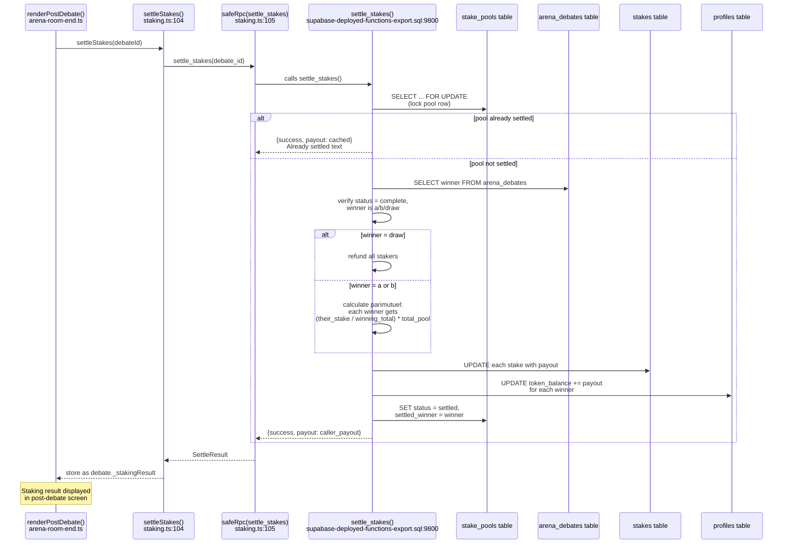

# F-09 — Token Prediction Staking — Interaction Map

## Summary

Token Prediction Staking is a parimutuel betting system where users wager tokens on debate outcomes. The staking panel renders in the pre-debate screen (`arena-room-setup.ts:78`) and lets users pick a side and stake an amount within their tier cap. Tier gates are based on profile depth: Unranked (0-9Q, locked), Spectator+ (10-24Q, max 5), Contender (25-49Q, max 25), Gladiator (50-74Q, max 50), Champion (75-99Q, max 100), Legend (100+Q, max 999999). All staking logic lives in `src/staking.ts` (343 lines) — RPC wrappers, odds calculation, panel rendering, and interactivity wiring. Three RPCs handle the lifecycle: `place_stake` (deducts tokens, creates stake), `get_stake_pool` (reads pool totals and user's stake), `settle_stakes` (parimutuel payout after debate ends). Settlement is called from `arena-room-end.ts:184` during post-debate processing. The system shipped in Sessions 109–118 with significant bug fixes (LM-174, LM-175, LM-182). S230 hardened `settle_stakes` by removing the `p_winner` and `p_multiplier` client params — the SQL now reads the winner from `arena_debates.winner` and hardcodes multiplier to 1.

## User actions in this feature

1. **User views staking panel in pre-debate** — panel renders with pool odds, tier info, and stake controls
2. **User places a stake** — selects side, enters amount, confirms
3. **Stakes settle after debate ends** — automatic, called during post-debate flow

---

## 1. User views staking panel in pre-debate

After both players accept a match, `showPreDebate()` at `arena-room-setup.ts:31` renders the pre-debate screen. At `arena-room-setup.ts:78`, it calls `getPool(debateId)` from `staking.ts:89` to fetch the current pool state, then `renderStakingPanel()` at `staking.ts:163` to generate the HTML, and `wireStakingPanel()` at `staking.ts:235` to attach event handlers.

`getPool()` calls `get_stake_pool` at `supabase-deployed-functions-export.sql:6119`, which reads `stake_pools` for totals and `stakes` for the user's existing stake. The panel renders in one of three states: locked (tier too low), active (side selection + amount input), or already-staked (shows current stake + pool bar).

**Notes:**
- The staking panel is wrapped in a try/catch at `arena-room-setup.ts:88` — if `getPool` fails, the panel silently doesn't render.
- The `questionsAnswered` value comes from the profile at `arena-room-setup.ts:85`. Tier calculation happens in `renderStakingPanel` via `getTier()` and `canStake()` from `tiers.ts`.
- LM-172: Tier thresholds must match between `src/tiers.ts` (client) and `place_stake` RPC (server). Both use the same breakpoints (10/25/50/75/100 questions).
- The pool bar shows percentage splits and total tokens, rendered by `_renderPoolBar()` at `staking.ts:139`.
- Quick-amount buttons (5, 10, 25, optionally 50 and 100 based on tier cap) are rendered at `staking.ts:206`.
- Unplugged debates skip staking entirely — checked at `arena-room-end.ts:178`.

---

## 2. User places a stake

After selecting a side (button click at `staking.ts:240`) and entering an amount (via quick buttons at `staking.ts:263` or manual input at `staking.ts:272`), the CONFIRM button at `staking.ts:280` calls `placeStake()` at `staking.ts:60`.

`placeStake()` validates client-side (non-empty, positive amount, within balance), then calls `place_stake` RPC at `supabase-deployed-functions-export.sql:7820`. The RPC does 9 checks: auth, valid side, positive amount, profile exists, tier calculation (identical thresholds to client), staking unlocked, amount within cap, sufficient balance, and debate is in a stakeable status (`pending`, `lobby`, or `matched`). It locks the profile row with `FOR UPDATE` to serialize concurrent stakes, then deducts tokens, creates/upserts the `stakes` row, and upserts the `stake_pools` row.

**Notes:**
- The `FOR UPDATE` lock on profiles at `supabase-deployed-functions-export.sql:7857` prevents race conditions where two browser tabs could double-spend the same tokens.
- LM-184: `place_stake` requires debate status IN (`pending`, `lobby`, `matched`) at `supabase-deployed-functions-export.sql:7900` (approx). If a debate is already `live`, the staking window is closed.
- The stake is an upsert — placing a second stake on the same debate replaces the first, with a refund of the original amount before deducting the new amount.
- Error display at `staking.ts:299` shows in the `#stake-error` element below the confirm button.
- Client-side balance check at `staking.ts:70` is a soft gate — the server re-verifies.

---

## 3. Stakes settle after debate ends

When a debate ends, `renderPostDebate()` at `arena-room-end.ts` calls `settleStakes(debateId)` at `arena-room-end.ts:184` (inside a try/catch). The `settleStakes()` wrapper at `staking.ts:104` calls `settle_stakes` RPC with only `p_debate_id` — the winner and multiplier are no longer client parameters as of Session 230.

The `settle_stakes` RPC at `supabase-deployed-functions-export.sql:9800` locks the pool row with `FOR UPDATE`, checks idempotency (already settled → returns cached payout), reads the authoritative winner from `arena_debates.winner`, calculates parimutuel payouts for all stakers in a loop (winning side splits the total pool proportionally), credits tokens to winners via `UPDATE profiles SET token_balance`, and marks the pool as `settled`. Draws refund everyone.

**Notes:**
- The `settle_stakes` RPC ignores the `p_winner` and `p_multiplier` parameters at `supabase-deployed-functions-export.sql:9813-9816`. The multiplier is hardcoded to 1. The winner is read from `arena_debates.winner`. This was a S230 security fix — previously, a client could pass `p_multiplier: 999999` for infinite payout.
- The `settle_stakes` catch block at `arena-room-end.ts:186` is: `catch (err) { console.error('[Arena] settleStakes failed:', err); }`. If settlement fails, the user's stake result is silently lost — no retry, no indication.
- Idempotency: if `pool.status = 'settled'`, the RPC returns the caller's cached payout at `supabase-deployed-functions-export.sql:9837`. This means multiple calls are safe (LM-182 fix).
- The staking result is stored on `debate._stakingResult` at `arena-room-end.ts:185` for display in the post-debate screen.
- Unplugged debates skip settlement entirely at `arena-room-end.ts:178` (`if (debate.ruleset !== 'unplugged')`).
- The deployed `settle_stakes` signature still shows `p_winner text` with no default at `supabase-deployed-functions-export.sql:9800`, but `staking.ts:105` calls it without `p_winner`. This works because PostgreSQL matches the 1-param call to the function, and the `p_winner` param is effectively ignored server-side. However, the signature mismatch between the export and the actual deployed version is flagged by LM-210.

---

## Cross-references

- [F-01 Queue / Matchmaking](./F-01-queue-matchmaking.md) — staking requires the debate to be in `pending`/`lobby`/`matched` status. The queue creates debates in `pending`, giving a staking window during the pre-debate screen.
- [F-02 Match Found](./F-02-match-found.md) — the accept/decline flow transitions the debate to `matched` status, which is still within the staking window.
- [F-57 Modifier & Power-Up System](./F-57-modifier-power-up-system.md) — the 2x Multiplier power-up "doubles staking payout on win" is preserved as an F-09 standalone rule, wired via `settle_stakes.p_multiplier` (currently hardcoded to 1 pending F-57 build).

## Known quirks

- **`settle_stakes` deployed signature mismatch.** The committed export at `supabase-deployed-functions-export.sql:9800` shows `settle_stakes(p_debate_id uuid, p_winner text, p_multiplier numeric DEFAULT 1)` — `p_winner` has NO DEFAULT. But `staking.ts:105` calls the RPC with only `p_debate_id`. This works in practice because the deployed version on Supabase likely has a different signature (with defaults) than the stale export. Flagged by LM-210: the export was last synced in S227 and is known stale.
- **Settlement catch block silently swallows errors.** At `arena-room-end.ts:186`, `catch (err) { console.error(...) }` means if settlement fails (network, RPC error, edge case), the user's tokens are locked in the pool with no retry mechanism. No UI indication of failure.
- **Staking panel try/catch silently hides the panel on error.** At `arena-room-setup.ts:88`, `catch (e) { console.warn(...) }` means if `getPool` fails, the entire staking panel is absent from the pre-debate screen with no error message.
- **Client-side tier thresholds must match server.** `staking.ts:170` calls `getTier()` from `tiers.ts` for the locked/unlocked UI decision. `place_stake` at `supabase-deployed-functions-export.sql:7864-7878` recalculates tiers independently. If thresholds drift, users could see "unlocked" UI but get rejected server-side. Per LM-172, both must be updated together.
- **Odds display uses hardcoded hex colors.** `_renderPoolBar()` at `staking.ts:152-153` uses `#2563eb` (blue) and `#cc0000` (red) instead of CSS variables. These survived the S205 visual token migration because they're inline styles inside template literals, not standalone CSS.
