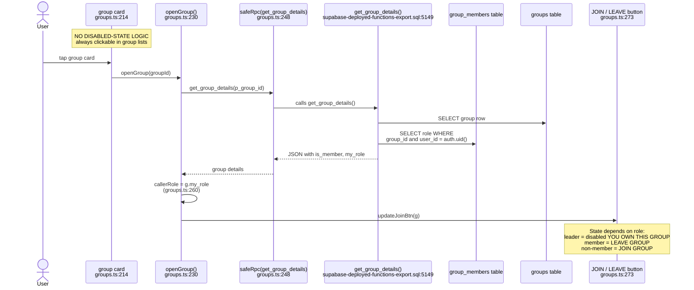
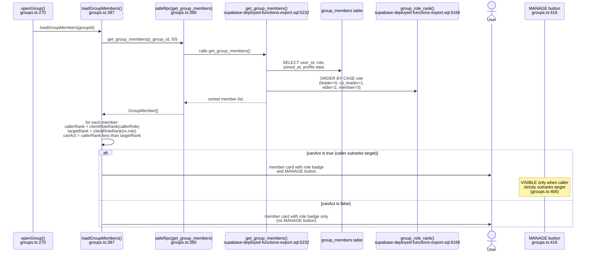
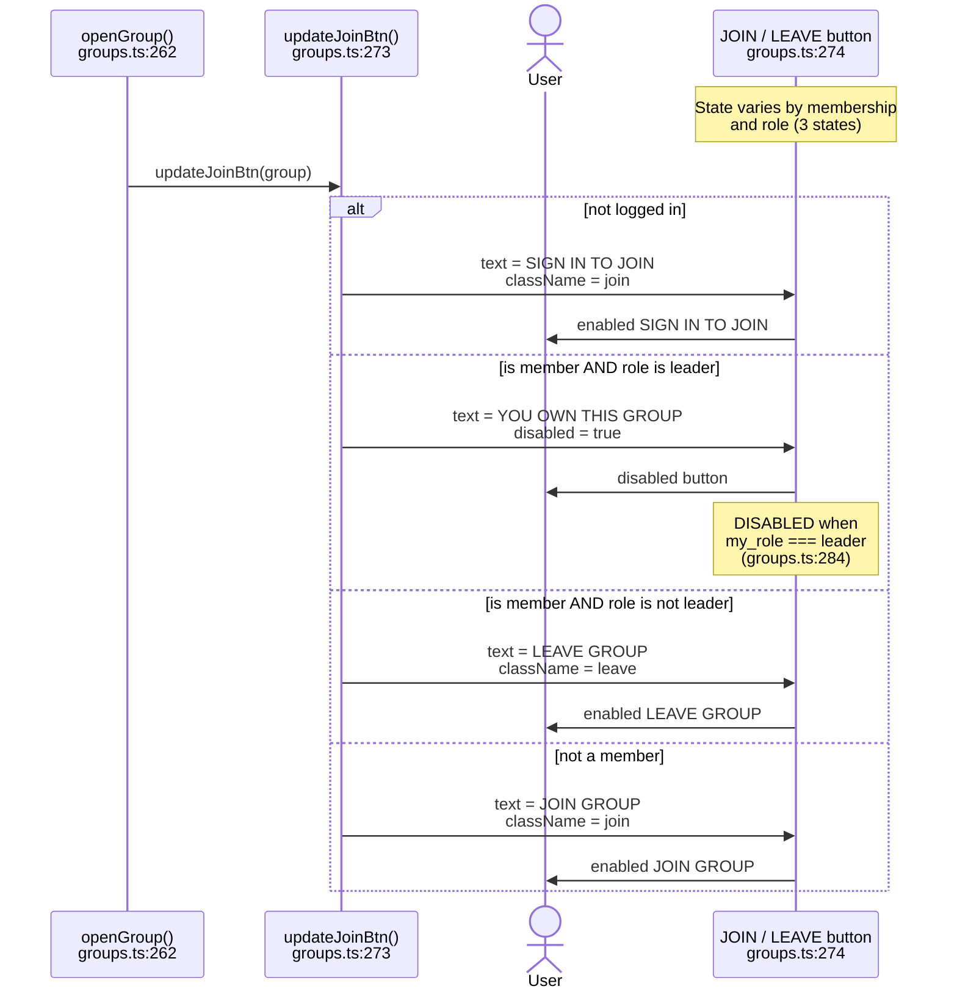
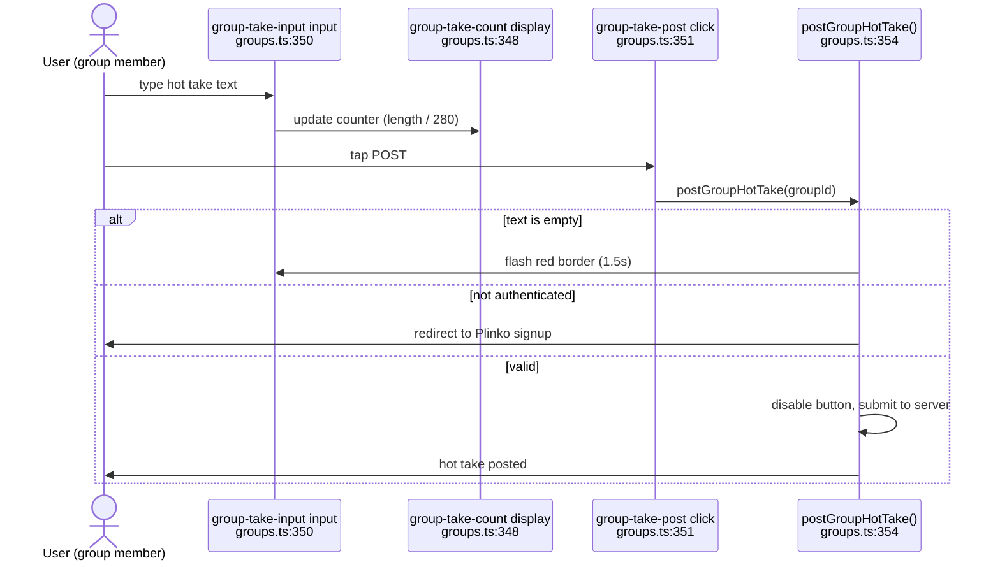
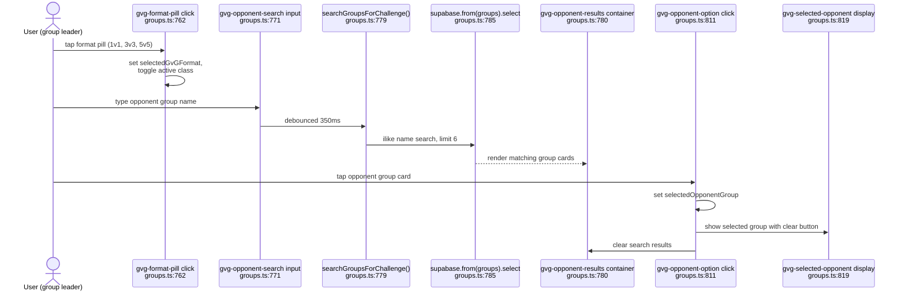
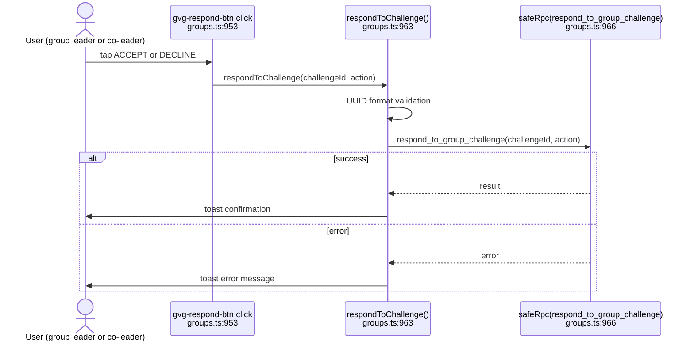

# F-14 — Role hierarchy (Leader, Co-Leader, Elder, Member) — Interaction Map

## Summary

The Role Hierarchy system assigns every group member one of four roles — Leader, Co-Leader, Elder, Member — and uses a numeric rank function (`group_role_rank()`) to determine authority ordering. All role-aware logic lives in `src/pages/groups.ts` (1128 lines), with three client-side helper functions mirroring the SQL rank: `clientRoleRank()` at line 67, `assignableRoles()` at line 79, and `roleLabel()` at line 87. The `get_group_details` RPC returns `my_role` for the current user, and `get_group_members` sorts the roster by role rank descending (leader first). The role hierarchy gates all F-15 management actions (kick/ban/promote) and determines whether a user sees the MANAGE button on member cards. The SQL rank function `group_role_rank()` at `supabase-deployed-functions-export.sql:6166` uses an inverted scale (leader=4, member=1) where higher is more authority, while the client mirror uses leader=1, member=4 where lower is more authority — both produce the same comparison result via inverted operators.

## User actions in this feature

1. **Open group detail — own role fetched and displayed** — `openGroup()` calls `get_group_details`, sets `callerRole`
2. **View member list with role-ordered roster** — `loadGroupMembers()` renders role badges, MANAGE buttons gated by rank
3. **Leader sees disabled LEAVE button** — leaders cannot leave without transferring leadership first

---

## 1. Open group detail — own role fetched and displayed

When a user taps a group card, `openGroup()` at `groups.ts:230` fetches the group via `safeRpc('get_group_details', { p_group_id })`. The RPC at `supabase-deployed-functions-export.sql:5149` looks up the caller's role from `group_members` and returns it as `my_role` in the JSON response. The client stores this in the module-level `callerRole` variable at `groups.ts:260`, which all subsequent role-gating reads from. The `updateJoinBtn()` call at `groups.ts:262` immediately uses the role to decide button state.

**Notes:**
- `callerRole` at `groups.ts:54` is a module-level variable, not per-group state. It is overwritten on every `openGroup()` call and cleared on `showLobby()` at `groups.ts:1021`.
- `get_group_details` is SECURITY DEFINER (`supabase-deployed-functions-export.sql:5152`), bypassing the self-referencing RLS issue documented in LM-141.
- For private groups, `get_group_details` raises an exception if the caller is not a member (`supabase-deployed-functions-export.sql:5174`). This was added in Session 224 (`session-224-private-group-info-leak-fix.sql:33`).
- `my_role` is NULL for non-members, which `callerRole` preserves via the `?? null` fallback at `groups.ts:260`.

---

## 2. View member list with role-ordered roster

After `openGroup()` fetches group details, it calls `loadGroupMembers()` at `groups.ts:270`. This function calls `safeRpc('get_group_members', { p_group_id, p_limit: 50 })` at `groups.ts:390`. The SQL function at `supabase-deployed-functions-export.sql:5232` sorts results by role rank descending (leader=0 first, member=3 last, then by Elo within each rank tier). The client renders each member with a role badge for non-member roles at `groups.ts:408-410` and evaluates `canAct` at `groups.ts:406` to determine whether a MANAGE button appears.

**Notes:**
- The SQL role sort at `supabase-deployed-functions-export.sql:5283-5290` uses a CASE expression with leader=0, co_leader=1, elder=2, member=3, then Elo descending within each tier. This is a different numeric convention than `group_role_rank()` (which uses leader=4, member=1). The sort CASE is inline, not calling `group_role_rank()`.
- The client's `clientRoleRank()` at `groups.ts:67-75` mirrors the sort direction (leader=1=highest authority, member=4=lowest). The comparison at `groups.ts:406` is `callerRank < targetRank` — a lower number means more authority.
- `canAct` requires both authentication (`!!currentUser`) and strict rank superiority. A co_leader cannot manage another co_leader — only someone strictly above.
- The MANAGE button at `groups.ts:416` stores `data-user-id`, `data-username`, `data-display-name`, and `data-role` attributes for the modal to read. This is the handoff point to F-15.
- `get_group_members` is SECURITY DEFINER (`supabase-deployed-functions-export.sql:5235`), required because direct `group_members` SELECT only returns the caller's own row per LM-141.
- For private groups, `get_group_members` blocks non-members (`supabase-deployed-functions-export.sql:5251-5263`), added in Session 224.

---

## 3. Leader sees disabled LEAVE button

When `updateJoinBtn()` at `groups.ts:273` runs for a member, it checks `g.my_role === 'leader'` at `groups.ts:282`. If the user is the leader, the button text becomes "YOU OWN THIS GROUP" and it is disabled (`groups.ts:284`). This prevents the leader from orphaning the group — they must transfer leadership via the F-15 promote flow first.

**Notes:**
- The leader-disabled check at `groups.ts:282-284` is client-side only. The `leave_group` RPC does not have a server-side guard preventing leaders from leaving — the disabled button is the only protection. If a client bypasses the disabled state, the leader could orphan the group.
- There is no tooltip or explanation for why the button is disabled. A leader seeing "YOU OWN THIS GROUP" must intuit that they need to transfer leadership first via F-15.
- Non-logged-in users see "SIGN IN TO JOIN" which redirects to `moderator-plinko.html` with a `returnTo` parameter on click (`groups.ts:983`). This is handled by `toggleMembership()`, not `updateJoinBtn()`.

---

## 4. User posts a group hot take

The group detail view includes a hot takes section with a character-counted textarea and a POST button. `_wireGroupTakeComposer()` at `groups.ts:345` wires two handlers: the input's `input` event updates a character counter display at `groups.ts:350`, and the POST button's `click` event calls `postGroupHotTake()` at `groups.ts:351`. The post function validates non-empty text, checks authentication (redirecting to Plinko if not logged in), and submits the take to the server.

<!-- captured: src/pages/groups.ts:350 -->
<!-- captured: src/pages/groups.ts:351 -->

**Notes:**
- captured: src/pages/groups.ts:350 — `#group-take-input` input event handler updates character counter.
- captured: src/pages/groups.ts:351 — `#group-take-post` click handler fires `postGroupHotTake()`.
- R6 decision: hot takes are a group social feature not directly related to role hierarchy or member management. Assigned to F-14 because `groups.ts` is in F-14's `files_touched` list and no dedicated hot-takes feature map exists. cross-feature: consider extraction.
- The character counter at `groups.ts:348` is a passive display updated on every keystroke. Maximum length is 280 characters.
- Auth check at `groups.ts:363` redirects unauthenticated users to `moderator-plinko.html` with a `returnTo` parameter pointing back to the current group.

---

## 5. User configures a GvG challenge

The Group vs Group (GvG) modal allows group leaders to challenge other groups. Three interactive elements handle challenge configuration: format pills at `groups.ts:762` let the user select between debate formats (1v1, 3v3, 5v5); a search input at `groups.ts:771` provides debounced (350ms) opponent group search via a direct Supabase query; and opponent option cards at `groups.ts:811` let the user select a group from search results.

<!-- captured: src/pages/groups.ts:762 -->
<!-- captured: src/pages/groups.ts:771 -->
<!-- captured: src/pages/groups.ts:811 -->

**Notes:**
- captured: src/pages/groups.ts:762 — `.gvg-format-pill` click handler toggles active pill styling and updates `selectedGvGFormat`.
- captured: src/pages/groups.ts:771 — `#gvg-opponent-search` input handler with 350ms debounce triggers `searchGroupsForChallenge()`.
- captured: src/pages/groups.ts:811 — `.gvg-opponent-option` click handler sets the selected opponent group and updates the display.
- R6 decision: GvG challenges are a group competition feature, not directly role hierarchy or member management. Assigned to F-14 because `groups.ts` is in F-14's `files_touched` list and the GvG modal is opened from group detail. cross-feature: consider extraction.
- The search queries the `groups` table directly via `supabase.from('groups').select(...)` at `groups.ts:785`, not through an RPC. This bypasses SECURITY DEFINER and relies on RLS.
- The opponent search excludes the current group (`neq('id', currentGroupId)`) and sorts by member count descending.

---

## 6. User responds to a GvG challenge

Incoming GvG challenges are rendered as cards by `loadGroupChallenges()`. Each card with a pending status shows ACCEPT and DECLINE buttons (`.gvg-respond-btn`). The click handler at `groups.ts:953` reads the challenge ID and action from data attributes and calls `respondToChallenge()` at `groups.ts:963`, which fires the `respond_to_group_challenge` RPC.

<!-- captured: src/pages/groups.ts:953 -->

**Notes:**
- captured: src/pages/groups.ts:953 — `.gvg-respond-btn` click handler with `stopPropagation()` to prevent card-level click propagation.
- R6 decision: GvG challenge responses are part of the group competition feature, not role hierarchy or member management. Assigned to F-14 alongside action 5 (GvG configuration). cross-feature: consider extraction.
- UUID validation at `groups.ts:964` validates the challenge ID format before sending to the RPC, preventing injection via crafted data attributes.
- The action parameter is either `'accept'` or `'decline'`, read from the `data-action` attribute on the button.

---

## 7. Event delegation root

_C-2 exemption: system_action — no user-initiated trigger; this is an infrastructure-level click delegation handler._

The global `document.addEventListener('click', ...)` at `groups.ts:1077` is the centralized event delegation root for the groups page. It intercepts clicks on any element with a `data-action` attribute and dispatches to the appropriate handler function. This replaces inline `onclick` handlers in the HTML and covers navigation, tab switching, category filtering, modal management, and group creation.

<!-- captured: src/pages/groups.ts:1077 -->

**Delegation targets:**
- `go-home` — navigate to index.html
- `open-create-modal` — openCreateModal()
- `switch-tab` — switchTab()
- `filter-category` — filterCategory()
- `show-lobby` — showLobby()
- `toggle-membership` — toggleMembership()
- `open-gvg-modal` — openGvGModal()
- `switch-detail-tab` — switchDetailTab()
- `create-modal-backdrop` — closeCreateModal() (with e.target guard)
- `select-emoji` — selectEmoji()
- `submit-create-group` — submitCreateGroup()
- `gvg-modal-backdrop` — closeGvGModal() (with e.target guard)
- `close-gvg-modal` — closeGvGModal()
- `submit-gvg-challenge` — submitGroupChallenge()
- `clear-gvg-opponent` — clearGvGOpponent()

**Notes:**
- captured: src/pages/groups.ts:1077 — global click delegation root. Not a user action; infrastructure that routes `data-action` attributes to handler functions.
- R6 decision: this handler dispatches to functions spanning multiple features (role hierarchy, member management, GvG, group creation). Assigned to F-14 as the broader groups infrastructure owner. cross-feature: consider extraction.
- The `closest('[data-action]')` lookup at `groups.ts:1078` walks up the DOM tree, so clicks on child elements of a `data-action` container still dispatch correctly.
- Modal backdrop handlers (`create-modal-backdrop`, `gvg-modal-backdrop`) include an `e.target` guard to prevent dismiss when clicking inside the modal content.

---

## Cross-references

- [F-15 Kick/Ban/Promote](./F-15-kick-ban-promote.md) — uses F-14's role hierarchy to gate all management actions. The MANAGE button in diagram 2 is the entry point to F-15's modal.

## Known quirks

- **SQL vs client rank number inversion.** `group_role_rank()` at `supabase-deployed-functions-export.sql:6166` uses leader=4, member=1 (higher=more authority). `clientRoleRank()` at `groups.ts:67` uses leader=1, member=4 (lower=more authority). And the inline sort CASE in `get_group_members` at `supabase-deployed-functions-export.sql:5283` uses leader=0, member=3. All three conventions produce the same ordering but the inconsistency is a maintenance hazard — a future developer modifying one must remember the others are inverted.
- **Leader leave button is client-side only.** The `leave_group` RPC has no server-side guard preventing a leader from leaving. If a client bypasses the disabled button at `groups.ts:284`, the group is orphaned with no leader. The `leave_group` RPC should check `role = 'leader'` and reject.
- **Silent catch in loadGroupMembers.** The catch block at `groups.ts:463` renders a generic error message but does not log the error or show a toast. If the RPC fails (e.g., private group rejection), the user sees "Could not load members" with no diagnostic.
- **Silent catch in openGroup.** The catch block at `groups.ts:264` sets the name to "Error loading group" but does not call `loadGroupMembers()`, `loadGroupHotTakes()`, or `loadGroupChallenges()` — those calls at `groups.ts:268-270` are outside the try/catch and run regardless, potentially failing themselves with missing context.
