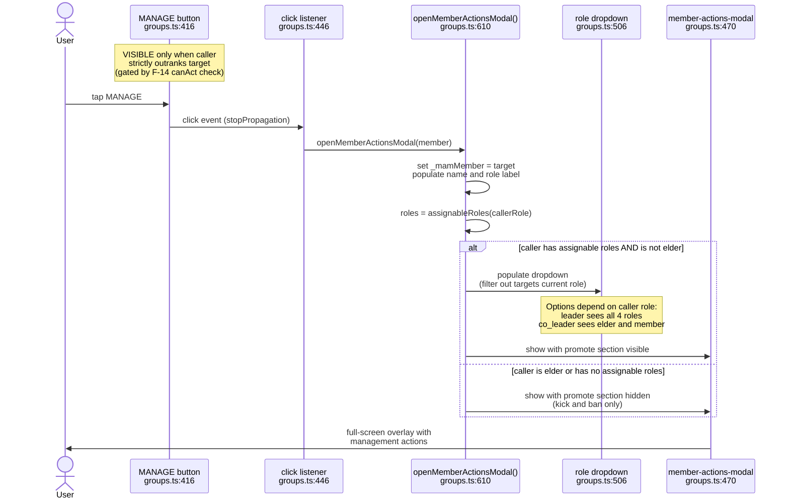
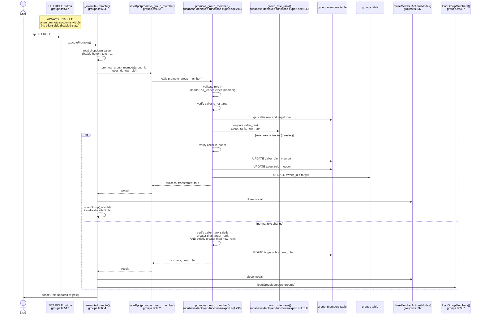
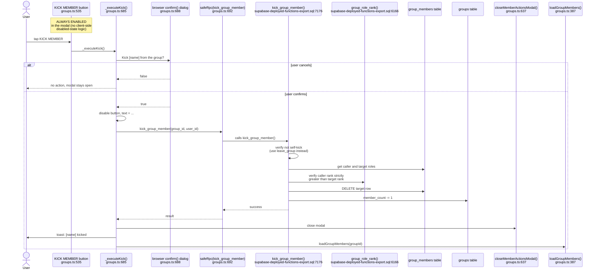
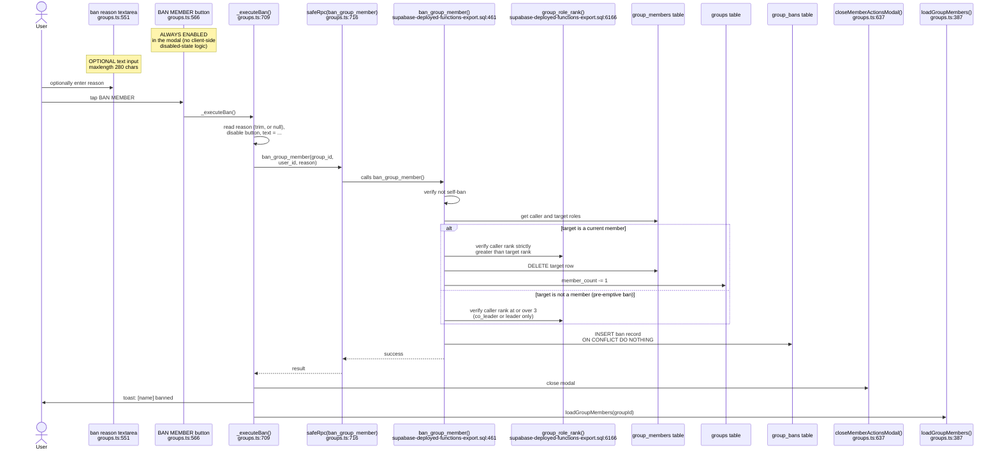

# F-15 — Kick/Ban/Promote — Interaction Map

## Summary

Kick/Ban/Promote adds the Member Actions Modal to the groups page, allowing higher-ranked members to manage lower-ranked ones. The modal is injected once at init by `_injectMemberActionsModal()` at `groups.ts:470` and reused for every MANAGE button click. It contains three sections: a role-change dropdown with SET ROLE button (promote/demote), a KICK MEMBER button, and a BAN MEMBER button with an optional reason textarea. All three actions call separate RPCs (`promote_group_member`, `kick_group_member`, `ban_group_member`) that enforce the F-14 rank hierarchy server-side via `group_role_rank()`. Leadership transfer is a special case of promote: when the target role is "leader", the SQL atomically demotes the caller to member, promotes the target, and updates `groups.owner_id`. Feature shipped alongside F-14 in Session 181. The unban path exists server-side (`unban_group_member` at `supabase-deployed-functions-export.sql:10399`) but has no client UI.

## User actions in this feature

1. **Open the MANAGE modal** — tap MANAGE on a member card, modal populates with target info
2. **Change a member's role** — select new role from dropdown, tap SET ROLE
3. **Kick a member** — tap KICK MEMBER, confirm via browser dialog
4. **Ban a member** — optionally enter reason, tap BAN MEMBER

---

## 1. Open the MANAGE modal

The MANAGE button is rendered by F-14's `loadGroupMembers()` at `groups.ts:416` for each member the caller outranks. The click handler at `groups.ts:446-456` reads data attributes from the button and calls `openMemberActionsModal()` at `groups.ts:610`. This function populates the modal with the target's name and current role, builds the promote dropdown based on `assignableRoles(callerRole)` at `groups.ts:622`, and shows or hides the promote section based on whether the caller has assignable roles.

**Notes:**
- The modal is injected exactly once at app init by `_injectMemberActionsModal()` at `groups.ts:470`, called from the `ready.then()` block at `groups.ts:101`. It is reused for every MANAGE click, not re-created.
- `_mamMember` at `groups.ts:608` stores the currently managed member as module-level state. It is set on open and cleared to null on close at `groups.ts:639`.
- The `stopPropagation()` call at `groups.ts:448` prevents the row click handler (which navigates to `/u/username`) from firing when the MANAGE button is clicked.
- The promote dropdown at `groups.ts:625` filters out the target's current role from the options. If all roles are filtered (i.e., only the current role was assignable), it falls back to showing all assignable roles.
- Elders have no assignable roles per `assignableRoles()` at `groups.ts:83` — they can kick and ban but cannot promote or demote. The promote section is hidden for them at `groups.ts:623`.
- The leader transfer option is labeled "(transfer leadership)" in the dropdown at `groups.ts:627`.

---

## 2. Change a member's role

The SET ROLE button at `groups.ts:517` calls `_executePromote()` at `groups.ts:654` on click (wired at `groups.ts:602`). This reads the selected role from the dropdown, calls `safeRpc('promote_group_member', { p_group_id, p_user_id, p_new_role })`, and on success closes the modal and refreshes the member list. Leadership transfer is a special case: when `newRole === 'leader'`, the entire group detail is reloaded to update `callerRole` (since the caller is now demoted to member).

**Notes:**
- The leadership transfer path at `supabase-deployed-functions-export.sql:8012-8027` is atomic: demote caller, promote target, update `groups.owner_id` all happen in one transaction.
- After a leadership transfer, the client calls `openGroup(currentGroupId)` at `groups.ts:674` instead of just `loadGroupMembers()`, because `callerRole` must be refreshed from the server (the caller is now a member, not leader).
- The SQL validates that the caller cannot change their own role (`supabase-deployed-functions-export.sql:7987-7989`).
- For non-transfer changes, the SQL enforces two rank checks: caller must strictly outrank the target (`supabase-deployed-functions-export.sql:8031-8033`) AND caller must strictly outrank the new role (`supabase-deployed-functions-export.sql:8035-8037`). This prevents a co_leader from promoting someone to co_leader (their own level).
- Error handling at `groups.ts:667-669` displays the error message in the modal's error area via `_setMamError()`, not as a toast. The button is re-enabled via the `finally` block at `groups.ts:681`.

---

## 3. Kick a member

The KICK MEMBER button at `groups.ts:535` calls `_executeKick()` at `groups.ts:685` on click. This shows a browser `confirm()` dialog at `groups.ts:688`, and on confirmation calls `safeRpc('kick_group_member', { p_group_id, p_user_id })`. The SQL deletes the member's `group_members` row and decrements `groups.member_count`.

**Notes:**
- The `confirm()` dialog at `groups.ts:688` is a browser-native confirmation. It is the only client-side guard before the kick RPC fires.
- The SQL explicitly blocks self-kicks at `supabase-deployed-functions-export.sql:7191-7192` with the message "Use leave_group to leave a group."
- The SQL uses `GREATEST(0, member_count - 1)` at `supabase-deployed-functions-export.sql:7219` to prevent the count from going negative.
- Kicked members can rejoin the group — kick does not create a ban record. Only the ban action creates a `group_bans` entry.
- Error display uses `_setMamError()` at `groups.ts:696` (modal inline error), not a toast. Success uses a toast at `groups.ts:700`.

---

## 4. Ban a member

The BAN MEMBER button at `groups.ts:566` calls `_executeBan()` at `groups.ts:709` on click. Unlike kick, ban does NOT show a confirmation dialog — it fires immediately. The SQL removes the member from `group_members` (if present), decrements `groups.member_count`, and inserts a row into `group_bans` with an optional reason. The ban can also be pre-emptive: leaders and co_leaders can ban non-members to block them from joining.

**Notes:**
- Ban does NOT have a confirmation dialog, unlike kick. This is an inconsistency — ban is a more severe action (blocked from rejoining) but requires fewer clicks.
- The ban reason textarea at `groups.ts:551` is optional (`p_reason text DEFAULT NULL` in the SQL at `supabase-deployed-functions-export.sql:461`). Empty strings are trimmed to null at `groups.ts:711`.
- `ON CONFLICT (group_id, user_id) DO NOTHING` at `supabase-deployed-functions-export.sql:513` means banning an already-banned user silently succeeds. The client shows a success toast even if the ban already existed.
- The pre-emptive ban path (target is not a member) requires rank at or over 3, which means co_leader (rank 3) or leader (rank 4) per `group_role_rank()`. Elders (rank 2) cannot pre-emptively ban.
- The `unban_group_member` RPC exists at `supabase-deployed-functions-export.sql:10399` but has no client UI. Unbanning requires direct SQL or a future admin panel.
- Error display uses `_setMamError()` at `groups.ts:722` (modal inline error). Success uses a toast at `groups.ts:725`.

---

## Cross-references

- [F-14 Role Hierarchy](./F-14-role-hierarchy.md) — parent feature. F-15 depends entirely on F-14's four-role rank system. The MANAGE button rendered in F-14's diagram 2 is the entry point to F-15's modal.

## Known quirks

- **No confirmation dialog for ban.** Kick shows a `confirm()` dialog at `groups.ts:688`, but ban fires immediately on button click. Ban is the more severe action (prevents rejoining) yet requires fewer clicks to execute.
- **Unban exists server-side but has no client UI.** `unban_group_member` at `supabase-deployed-functions-export.sql:10399` is a functional RPC (auth + rank check + delete from `group_bans`) but nothing in the client calls it. A banned user cannot be unbanned without direct SQL access.
- **`_executeBan` and `_executeKick` swallow generic errors.** Both catch blocks at `groups.ts:728` and `groups.ts:704` call `_setMamError('Something went wrong')`, discarding the actual error object. The original exception message is lost.
- **Leadership transfer refreshes the whole group, but kick/ban only refresh the member list.** After a leadership transfer at `groups.ts:674`, `openGroup(currentGroupId)` re-fetches everything (details, hot takes, challenges, members). After kick/ban, only `loadGroupMembers()` is called at `groups.ts:701`/`groups.ts:726`. This means the header member count (`detail-members`) is not updated after kick/ban — only the member list re-renders. The count updates only after a full page refresh or re-opening the group.
- **Session 223 security fixes.** `session-223-group-rpc-fixes.sql` patched three critical group RPCs: `resolve_group_challenge` (was unauthenticated), `update_group_elo` (dropped entirely — any user could manipulate any group Elo), and `join_group` (was missing `is_public` check). These are adjacent to F-15 but affect the broader groups system.
