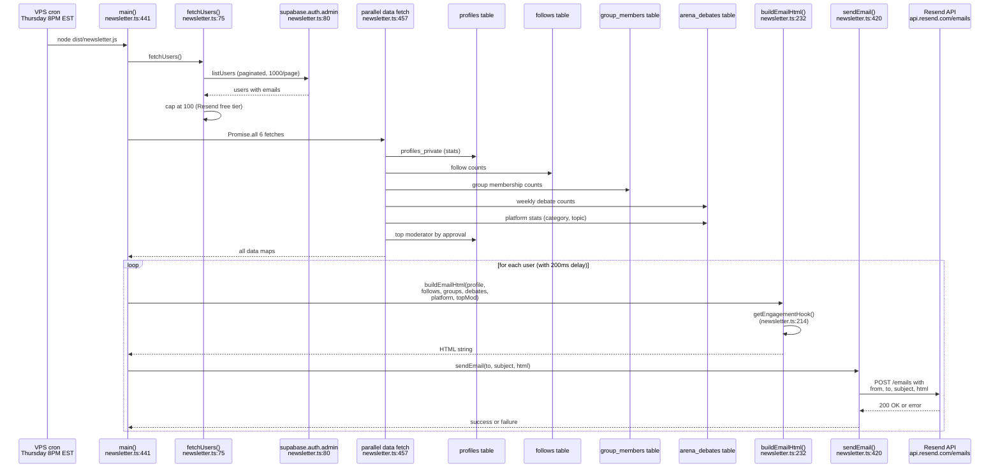
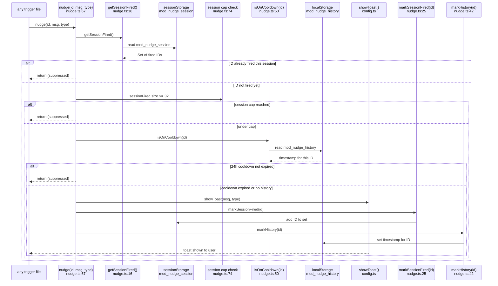
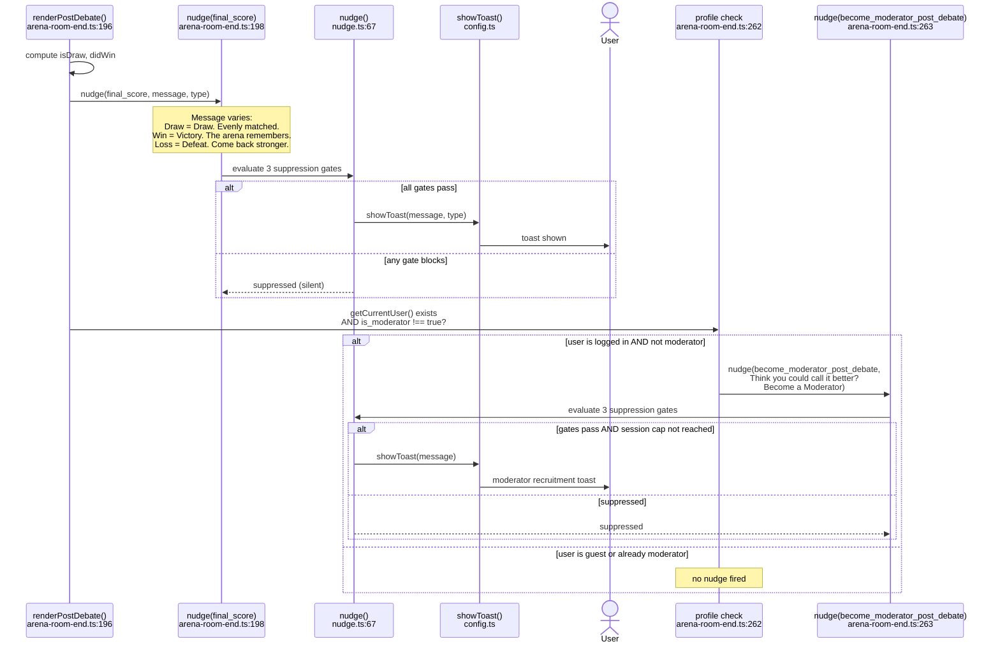

# F-35 — Weekly newsletter + in-app toasts — Interaction Map

## Summary

F-35 has two independent subsystems. **F-35A (newsletter)**: a standalone VPS script (`newsletter.ts`, 505 lines) that sends personalized weekly emails via Resend every Thursday at 8PM EST. It runs as `node dist/newsletter.js` on cron — NOT managed by PM2, not part of the bot army. It uses a service_role Supabase client to batch-fetch user data (profiles, follows, groups, weekly debate counts, platform stats, top moderator), builds a personalized HTML email per user, and sends via Resend's API with a 100/day cap and 200ms rate-limit spacing. **F-35B (nudge toasts)**: a client-side toast engine (`src/nudge.ts`, 83 lines) that fires polite engagement messages at key app moments. The engine has three-tier suppression: once per session per ID (sessionStorage), 3 per session total cap, and 24-hour cooldown per ID (localStorage). There are 9 distinct nudge IDs across 7 files. The nudge module imports `showToast()` from `src/config.ts` and is imported by 7 consumer files. F-35A shipped in Session 187, F-35B shipped in Session 190.

## User actions in this feature

1. **Newsletter cron sends weekly personalized email** — VPS script fetches data, builds HTML, sends via Resend
2. **Nudge toast fires with three-tier suppression** — `nudge()` evaluates session/cap/cooldown gates before showing toast
3. **Post-debate nudges fire** — representative trigger showing final_score and become_moderator nudges at debate end

---

## 1. Newsletter cron sends weekly personalized email

The newsletter script at `newsletter.ts:441` runs as a standalone Node process on the VPS. It fetches all users with emails (capped at 100 for Resend free tier at `newsletter.ts:92`), batch-fetches six data dimensions in parallel at `newsletter.ts:457`, then loops through users building personalized HTML emails. Each email contains: user stats (Elo, win rate, streak, tokens, level), conditional follow/group sections, a Moderator Spotlight section featuring the top-rated moderator, platform-wide stats (total debates, top category, trending topic), and a personalized engagement hook based on the user's profile at `newsletter.ts:214-228`. Emails are sent via Resend's REST API at `newsletter.ts:420` with 200ms spacing between sends.

**Notes:**
- The newsletter uses `supabase.auth.admin.listUsers()` at `newsletter.ts:80` (service_role), not an RPC. No RPCs are called by this feature.
- The `profiles_private` view is used at `newsletter.ts:103` — this returns all profile data including token_balance, which would not be visible via `profiles_public`.
- The 100-user cap at `newsletter.ts:92` is a Resend free-tier limitation. Users beyond the cap are silently dropped with a warning log. There is no prioritization — it sends to the first 100 returned by `listUsers()`.
- The `getEngagementHook()` function at `newsletter.ts:214` selects one of five personalized messages based on profile depth, streak, follow count, and group count. This is the primary CTA driver in the email.
- The Moderator Spotlight section at `newsletter.ts:354-370` fetches the top moderator by `mod_approval_pct` at `newsletter.ts:167-179`. If no moderator has debates, the section shows "The Moderator needs moderators. Be the first." with a link to Settings.
- There is no unsubscribe mechanism. The footer at `newsletter.ts:398-403` says "You're receiving this because you have an account" but provides no opt-out link. This is a compliance gap.
- Failed sends are logged at `newsletter.ts:432` but do not retry. The script runs once and exits.
- The `FROM_EMAIL` at `newsletter.ts:19` is `newsletter@themoderator.app`, which requires Resend domain verification.

---

## 2. Nudge toast fires with three-tier suppression

The `nudge()` function at `nudge.ts:67` is called by consumer files with an ID string, a message, and an optional type. Before firing `showToast()`, it evaluates three suppression gates in order: (1) already fired this session for this ID (`nudge.ts:71`), (2) session cap of 3 reached (`nudge.ts:74`), (3) 24-hour cooldown not expired for this ID (`nudge.ts:77`). If all three pass, the toast fires and both session and history are marked.

**Notes:**
- The session cap of 3 at `nudge.ts:13` prevents toast fatigue. Once 3 distinct nudge IDs have fired in a session, no further nudges fire regardless of cooldown state.
- The 24-hour cooldown at `nudge.ts:14` (`COOLDOWN_MS = 86400000`) is per ID, not global. A user can see the same nudge again 24 hours later if the session cap allows.
- Both `sessionStorage` and `localStorage` operations are wrapped in try/catch with empty catches at `nudge.ts:21`, `nudge.ts:30`, `nudge.ts:38`, `nudge.ts:47`, and `nudge.ts:57`. If storage is unavailable (private browsing, full storage), the nudge silently fires without suppression.
- `showToast()` is imported from `src/config.ts` at `nudge.ts:9`. Per LM-155, if a page doesn't load config.ts, `showToast` would not exist and the import would fail at module load time, preventing the nudge module from loading at all on that page.
- The nudge module has no `destroy()` or cleanup function. The `sessionStorage` data is automatically cleared when the tab closes. The `localStorage` history accumulates indefinitely — there is no pruning of expired entries.

---

## 3. Post-debate nudges fire

After a debate ends, `renderPostDebate()` at `arena-room-end.ts:198` fires the `final_score` nudge with a win/loss/draw-specific message. Five lines later at `arena-room-end.ts:263`, a moderator recruitment nudge fires for logged-in non-moderators via `nudge('become_moderator_post_debate', ...)`. This second nudge is the F-50 moderator discovery touchpoint — it lives in F-35's nudge infrastructure but its purpose belongs to F-50.

**Notes:**
- The `final_score` nudge at `arena-room-end.ts:198` uses different toast types: `success` for wins, `info` for draws and losses. The message text also varies by outcome.
- The `become_moderator_post_debate` nudge at `arena-room-end.ts:263` is gated by `getCurrentUser()` (must be authenticated) AND `getCurrentProfile()?.is_moderator !== true` (must not already be a moderator). This is a F-50 touchpoint using F-35 infrastructure.
- If both nudges fire in the same session tick, they count as 2 of the 3-per-session cap. A user who enters a debate (nudge #1 from `arena-room-setup.ts:172`), finishes a round (`arena-room-live.ts:184`, nudge #2), and then sees the final score (`arena-room-end.ts:198`, nudge #3) has hit the cap — the moderator recruitment nudge would be suppressed.
- The `enter_debate` nudge at `arena-room-setup.ts:158` and `arena-room-setup.ts:172` uses two different messages for live mode vs other modes, but the same nudge ID. The second call is suppressed by the session-already-fired check.

---

## Cross-references

- [F-50 Moderator Discovery](./F-50-moderator-discovery.md) — F-50 touchpoint 1 (post-debate nudge) uses F-35's `nudge()` function at `arena-room-end.ts:263`. F-50 maps the discovery intent; F-35 maps the delivery mechanism.
- [F-09 Token Prediction Staking](./F-09-token-staking.md) — the `return_visit` nudge at `tokens.ts:344` fires during daily login processing, which is F-09 / token system territory.

## Known quirks

- **No unsubscribe mechanism in newsletter.** The email footer at `newsletter.ts:398-403` says "You're receiving this because you have an account" but provides no opt-out link. This is a CAN-SPAM / GDPR compliance gap.
- **100-user cap with no prioritization.** The `SEND_CAP` at `newsletter.ts:21` limits sends to 100 users (Resend free tier). Users beyond the cap are dropped without any sorting by engagement, activity, or recency. The first 100 returned by `listUsers()` pagination get the email.
- **Newsletter fetches `profiles_private` view.** At `newsletter.ts:103`, the service_role client reads `profiles_private` which includes `token_balance`. Token balance is displayed in the email. This is intentional but notable — token balances are exposed in email content.
- **localStorage nudge history never prunes.** The `mod_nudge_history` key in localStorage at `nudge.ts:42-48` stores timestamps for every nudge ID ever fired. Old entries with expired cooldowns are never cleaned up. Over time this accumulates unboundedly, though the data is small (one timestamp per nudge ID, ~9 IDs total).
- **Silent catch in all storage operations.** Five empty catch blocks in `nudge.ts` (lines 21, 30, 38, 47, 57) swallow storage errors. If `sessionStorage` or `localStorage` throws (e.g., Safari private browsing quota), the nudge fires without any suppression — the user could see duplicate nudges.
- **`feed_debate_end` nudge ID was added post-F-35 shipping.** The `feed_debate_end` nudge at `arena-feed-room.ts:1040` and `arena-feed-room.ts:1150` was added for F-51's live debate feed, not as part of the original F-35 implementation. The original 8 trigger points from Session 190 did not include this one.
- **`v_topic_sentiment` view used without error handling.** At `newsletter.ts:202-206`, the trending topic fetch queries `v_topic_sentiment` and falls back to "Hot Takes" if empty. If the view doesn't exist or throws, the `fetchPlatformStats()` function at `newsletter.ts:182` would throw and crash the entire newsletter run.
