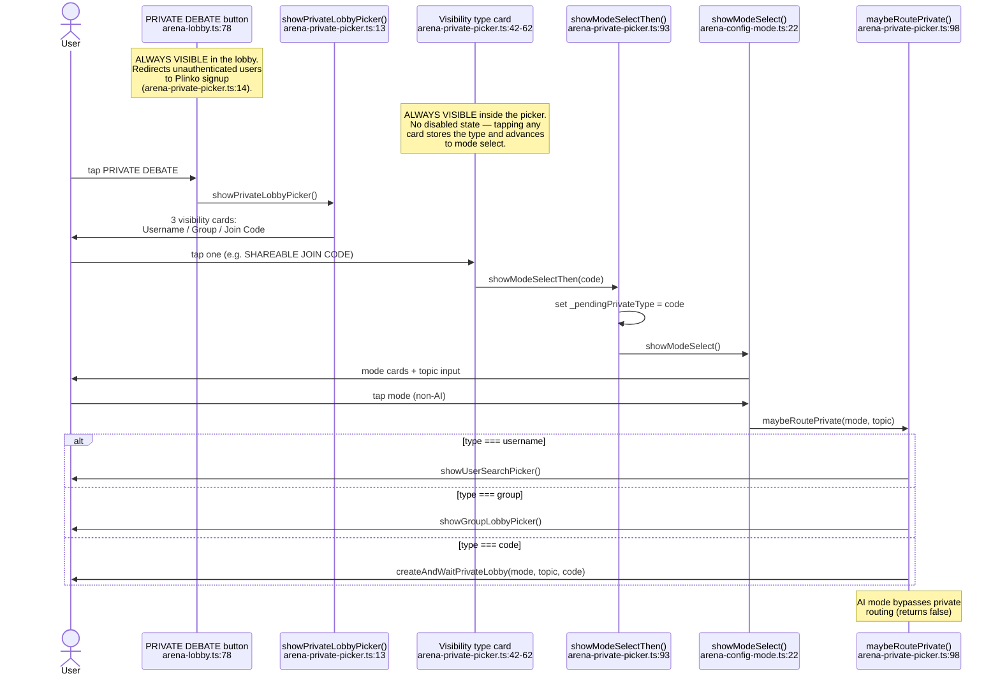
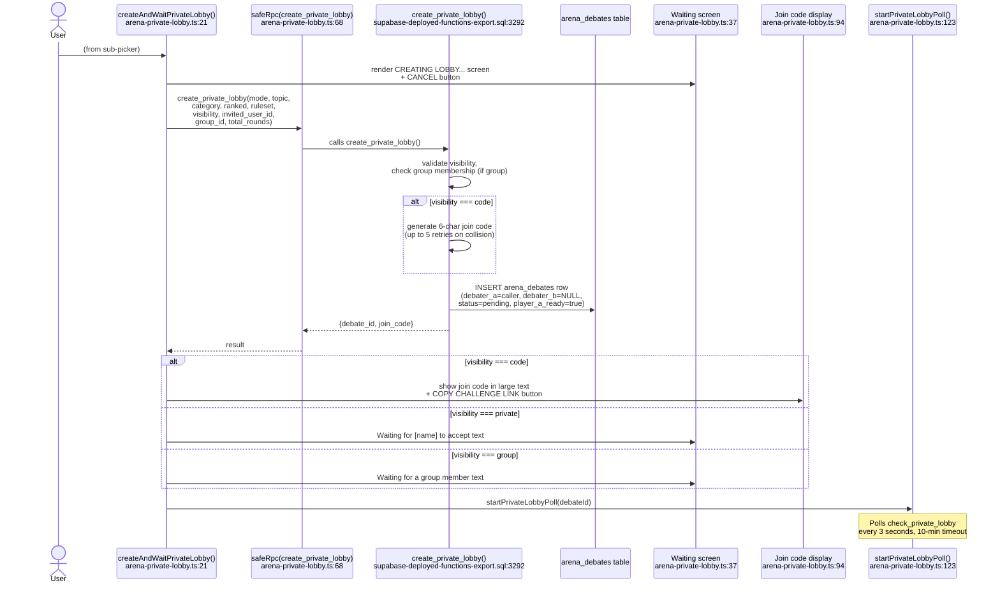
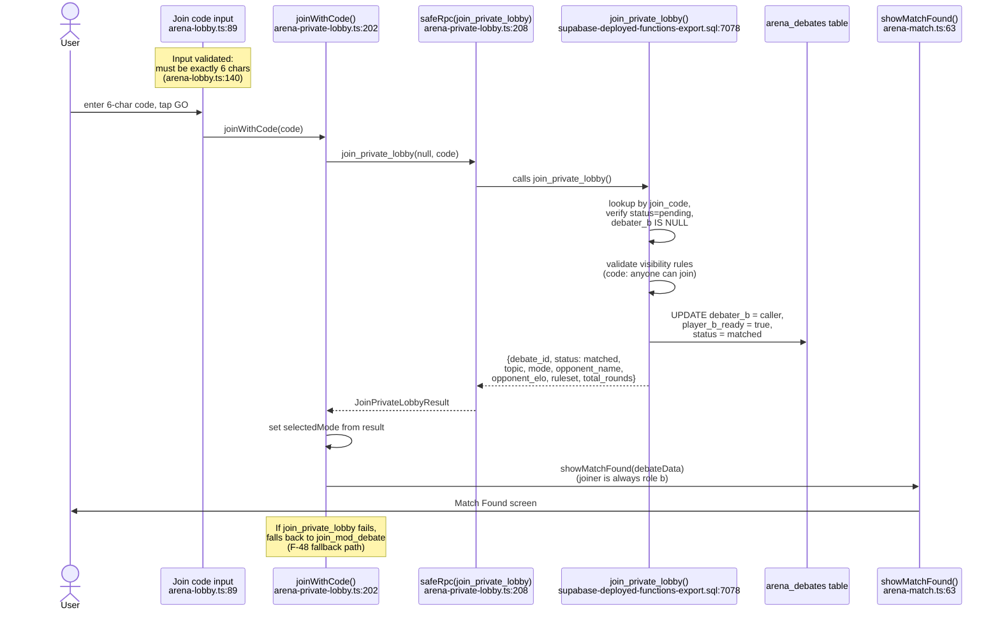
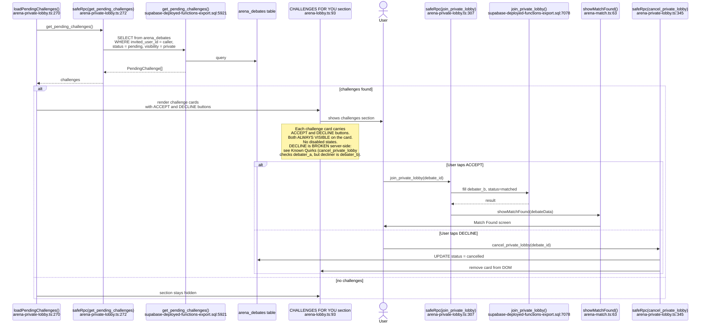
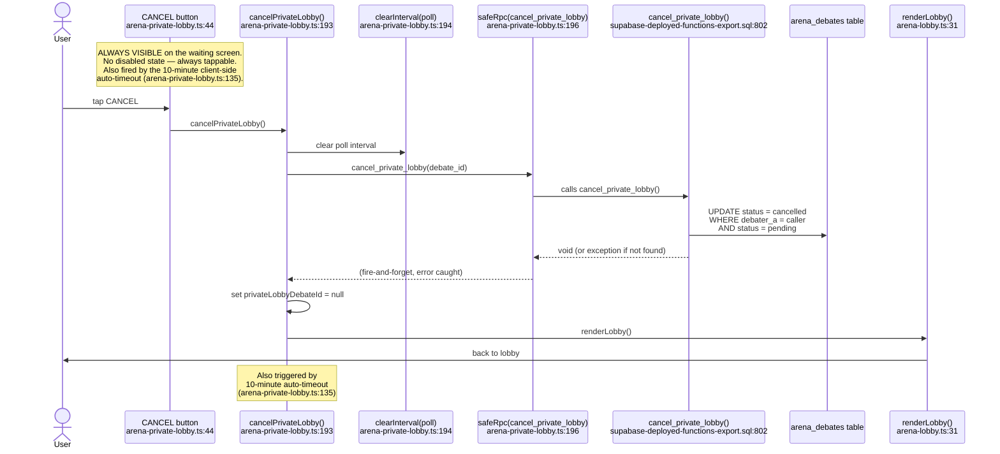

# F-46 — Private Lobby / Invite-Only Debate — Interaction Map

## Summary

Private Lobby provides three ways to create invite-only debates outside the public queue: username challenge (direct invite to a specific user), group-only lobby (any member of your group can join), and shareable join code (6-character code, share anywhere). The feature has two client files: `src/arena/arena-private-picker.ts` (264 lines) handles the visibility picker, user search, and group selection; `src/arena/arena-private-lobby.ts` (354 lines) handles lobby creation, polling, joining, cancellation, and the pending challenges feed. The flow integrates with F-01's mode select — the private lobby type is stored as `_pendingPrivateType` state, and `maybeRoutePrivate()` intercepts the mode select callback to redirect to the appropriate sub-picker. Five SQL RPCs handle the lifecycle: `create_private_lobby` (9-param version creates the debate), `check_private_lobby` (poll for opponent), `join_private_lobby` (joins by ID or code), `cancel_private_lobby` (creator cancels), and `get_pending_challenges` (shows incoming direct challenges in the lobby). Additionally, `search_users_by_username` powers the user search for direct challenges. Shipped in Session 173, verified complete in Session 179 with all RPCs live.

## User actions in this feature

1. **User opens private lobby picker** — taps PRIVATE DEBATE in the arena lobby
2. **User creates a private lobby** — picks visibility type, configures mode, starts waiting
3. **Opponent joins via join code** — enters 6-char code in lobby's join-code input
4. **Opponent accepts a direct challenge** — sees challenge card in lobby, taps ACCEPT
5. **Creator cancels the lobby** — taps CANCEL on waiting screen, or 10-minute timeout

---

## 1. User opens private lobby picker

The PRIVATE DEBATE button at `arena-lobby.ts:78` fires `showPrivateLobbyPicker()` from `arena-private-picker.ts:13` on click (`arena-lobby.ts:122`). The picker renders three visibility cards: CHALLENGE BY USERNAME, GROUP MEMBERS ONLY, and SHAREABLE JOIN CODE. Each card stores the private type and then chains into the mode select flow from F-01.

Selecting a visibility type calls `showModeSelectThen()` at `arena-private-picker.ts:93`, which stores the type in `_pendingPrivateType` state, then opens `showModeSelect()` from F-01's config chain. When the user picks a non-AI mode, `maybeRoutePrivate()` at `arena-private-picker.ts:98` intercepts the callback and routes to the appropriate sub-flow instead of the category picker.

**Notes:**
- The private lobby picker also includes a round picker (`roundPickerHTML()` and `wireRoundPicker()` from `arena-config-settings.ts`) at `arena-private-picker.ts:63`.
- AI Sparring cannot be private — `maybeRoutePrivate()` returns false for AI mode at `arena-private-picker.ts:102`, falling through to the normal AI queue path.
- Auth gate: `showPrivateLobbyPicker()` redirects unauthenticated users to the Plinko signup page at `arena-private-picker.ts:14`.

---

## 2. User creates a private lobby

All three paths converge on `createAndWaitPrivateLobby()` at `arena-private-lobby.ts:21`, which takes mode, topic, visibility, and optional invited-user/group IDs. For the username path, `showUserSearchPicker()` at `arena-private-picker.ts:109` first presents a debounced search input (350ms, calls `search_users_by_username` RPC at `arena-private-picker.ts:157`). For the group path, `showGroupLobbyPicker()` at `arena-private-picker.ts:200` loads the user's groups via `get_my_groups` RPC and presents a list.

`createAndWaitPrivateLobby()` calls `create_private_lobby` RPC with 9 parameters. The SQL at `supabase-deployed-functions-export.sql:3292` validates visibility, generates a 6-char join code (for `code` visibility only, up to 5 retry attempts), and inserts an `arena_debates` row with `debater_a` set, `debater_b` NULL, `status = 'pending'`, and `player_a_ready = true`. The client then renders the waiting screen with context-specific text: join code display for `code`, "Waiting for [name]" for `private`, "Waiting for a group member" for `group`.

**Notes:**
- Three overloaded versions of `create_private_lobby` exist in the deployed export (lines 3154, 3223, 3292). The client calls the 9-param version.
- The Copy Challenge Link button at `arena-private-lobby.ts:101` generates a URL in the format `https://themoderator.app/challenge?code=XXXXXX` and copies to clipboard.
- The poll at `arena-private-lobby.ts:128` fires every 3 seconds and auto-stops if the view changes at line 130.
- The poll has a 10-minute hard timeout at `arena-private-lobby.ts:135` — if no one joins, the lobby is cancelled and a toast is shown.
- The poll's catch block at `arena-private-lobby.ts:166` is empty: `catch { /* retry next tick */ }`. Network failures during polling produce no user feedback.
- LM-200 applies: the `stamp_debate_language` trigger fires on the INSERT and stamps the creator's language preference.

---

## 3. Opponent joins via join code

The join-code input at `arena-lobby.ts:89` and GO button at `arena-lobby.ts:90` fire `joinWithCode()` from `arena-private-lobby.ts:202` when the code is exactly 6 characters (`arena-lobby.ts:140`). `joinWithCode()` calls `join_private_lobby` with `p_join_code` set and `p_debate_id` null.

The `join_private_lobby` RPC at `supabase-deployed-functions-export.sql:7078` looks up the debate by `join_code` (or by ID for direct challenges), checks the lobby is still `pending` with `debater_b IS NULL`, validates visibility rules (private: only invited user; group: only group members; code: anyone), then UPDATEs `debater_b` and sets `status = 'matched'`, `player_b_ready = true`. The joiner is always role `b`.

On the creator's side, the `check_private_lobby` poll at `arena-private-lobby.ts:144` detects `status === 'matched'` and calls `onPrivateLobbyMatched()` at `arena-private-lobby.ts:170`, which routes to `showMatchFound()` (the F-02 accept/decline screen — but `player_a_ready` was already set to true at creation time).

If `join_private_lobby` fails (not a regular private lobby), `joinWithCode()` falls through to try `join_mod_debate` at `arena-private-lobby.ts:234` — this is the F-48 fallback path for mod-initiated debates.

**Notes:**
- The join-code input also supports Enter key submission at `arena-lobby.ts:143`.
- `join_private_lobby` does NOT use `FOR UPDATE SKIP LOCKED` — it relies on the `AND debater_b IS NULL AND status = 'pending'` condition plus `GET DIAGNOSTICS ROW_COUNT` check at `supabase-deployed-functions-export.sql:7134` to detect races. If two users join simultaneously, one succeeds and the other gets "Lobby already taken".
- The joiner always gets `role: 'b'` and sees the Match Found screen directly. The creator (role `a`) sees it via the poll detecting `matched` status.
- `joinWithCode()` sets `ranked: false` hardcoded at `arena-private-lobby.ts:225` regardless of the lobby's actual ranked setting. This means the joiner's `CurrentDebate` may have the wrong ranked flag. The server enforces the actual ranked status.

---

## 4. Opponent accepts a direct challenge

When a user opens the arena lobby, `loadPendingChallenges()` at `arena-private-lobby.ts:270` fires (for authenticated users, `arena-lobby.ts:157`). It calls `get_pending_challenges` which returns all `arena_debates` rows where `invited_user_id = caller`, `status = 'pending'`, and `visibility = 'private'`.

The challenges render as cards in a dedicated "CHALLENGES FOR YOU" section at `arena-lobby.ts:93`. Each card has an ACCEPT and DECLINE button. ACCEPT calls `join_private_lobby` with the debate ID at `arena-private-lobby.ts:307`, which fills `debater_b` and routes to `showMatchFound()`. DECLINE calls `cancel_private_lobby` at `arena-private-lobby.ts:345`, which sets the debate to `cancelled` — note: this lets the invited user cancel the challenger's lobby.

**Notes:**
- The DECLINE button calls `cancel_private_lobby` (`arena-private-lobby.ts:345`), which checks `debater_a = v_user_id` at `supabase-deployed-functions-export.sql:818`. This means the DECLINE should fail server-side since the declining user is the invited user, not `debater_a`. However, the client catches the error silently at `arena-private-lobby.ts:346` and still removes the card from the DOM — the card disappears visually but the lobby remains open server-side.
- The challenges section at `arena-lobby.ts:93` is hidden by default (`display:none`) and only shown when `loadPendingChallenges()` returns results.
- `loadPendingChallenges` is wrapped in a top-level `try/catch` at `arena-private-lobby.ts:352` that silently swallows errors: `catch { /* silent — challenges are optional */ }`.

---

## 5. Creator cancels the lobby

The CANCEL button on the waiting screen at `arena-private-lobby.ts:44` fires `cancelPrivateLobby()` at `arena-private-lobby.ts:193`. This clears the poll timer, calls `cancel_private_lobby` RPC (fire-and-forget), clears `privateLobbyDebateId`, and returns to the lobby.

The `cancel_private_lobby` RPC at `supabase-deployed-functions-export.sql:802` is simple: it UPDATEs `status = 'cancelled'` on the debate row where `debater_a = caller AND status = 'pending'`. If the lobby has already been joined (status changed to `matched`), the cancel fails silently.

The 10-minute auto-timeout at `arena-private-lobby.ts:135` also calls `cancelPrivateLobby()` with a toast "Lobby expired — no one joined".

**Notes:**
- The cancel RPC is fire-and-forget at `arena-private-lobby.ts:196` — `.catch((e) => console.warn(...))`. If it fails, the user still returns to the lobby, but the server-side debate remains in `pending` status until it ages out.
- The 10-minute timeout at `arena-private-lobby.ts:126` (`TIMEOUT_SEC = 600`) is client-side only. If the tab is backgrounded, the timer may stall, leaving the lobby in `pending` state indefinitely on the server.
- `cancel_private_lobby` does NOT check if `debater_b` has joined — it only checks `status = 'pending'`. Since `join_private_lobby` atomically sets status to `matched`, the cancel will fail if a joiner slips in first.

---

## Cross-references

- [F-01 Queue / Matchmaking](./F-01-queue-matchmaking.md) — shares the lobby UI and mode select flow. The PRIVATE DEBATE button lives alongside ENTER THE ARENA. Private lobby uses the same mode/topic pickers via `maybeRoutePrivate()` intercept.
- [F-47 Moderator Marketplace](./F-47-moderator-marketplace.md) — private lobby debates can request moderators via `request_mod_for_debate` after match acceptance, surfacing them in the Mod Queue.
- [F-48 Mod-Initiated Debate](./F-48-mod-initiated-debate.md) — `joinWithCode()` in `arena-private-lobby.ts:202` first tries `join_private_lobby`, then falls back to `join_mod_debate` for mod-created debates. This fallback is the bridge between F-46 and F-48.

## Known quirks

- **Three overloaded `create_private_lobby` functions.** Lines 3154 (7-param), 3223 (8-param), and 3292 (9-param). Client calls the 9-param version. The 7-param legacy version does not pass `ruleset` or `total_rounds`, defaulting to `amplified` and 3 rounds respectively — differs from the current default of 4 rounds.
- **DECLINE button on pending challenges is broken server-side.** `cancel_private_lobby` checks `debater_a = v_user_id` at `supabase-deployed-functions-export.sql:818`, but the declining user is the invited user (`debater_b`), not the creator. The RPC raises an exception, the client catches it silently at `arena-private-lobby.ts:346`, and the card is removed from the DOM — but the lobby remains open server-side. The creator's poll will not detect the "decline."
- **`joinWithCode` hardcodes `ranked: false` for the joiner.** At `arena-private-lobby.ts:225`, the `CurrentDebate` object for the joining user always sets `ranked: false` regardless of the lobby's actual setting. The server enforces the correct ranked behavior, but the client UI may display the wrong badge.
- **Private lobby poll has empty catch block.** At `arena-private-lobby.ts:166`, `catch { /* retry next tick */ }` silently swallows network errors during polling. The creator gets no indication if `check_private_lobby` is failing.
- **10-minute timeout is client-side only.** The poll timeout at `arena-private-lobby.ts:126` fires after 600 seconds of client-side elapsed time. Tab backgrounding, device sleep, or network interruption can prevent the timeout from firing, leaving the lobby in `pending` status on the server with no cleanup mechanism.
- **`loadPendingChallenges` silently swallows all errors.** At `arena-private-lobby.ts:352`, `catch { /* silent — challenges are optional */ }`. If the RPC fails, the challenges section simply doesn't appear — the user may have pending challenges they never see.
