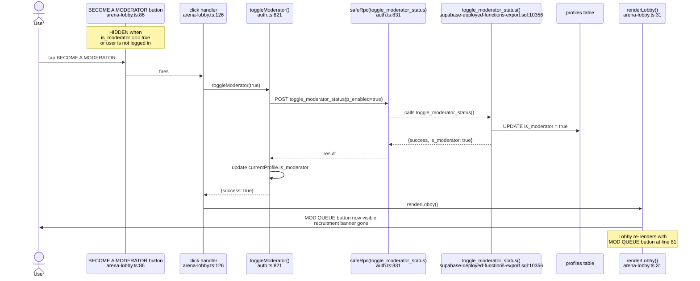
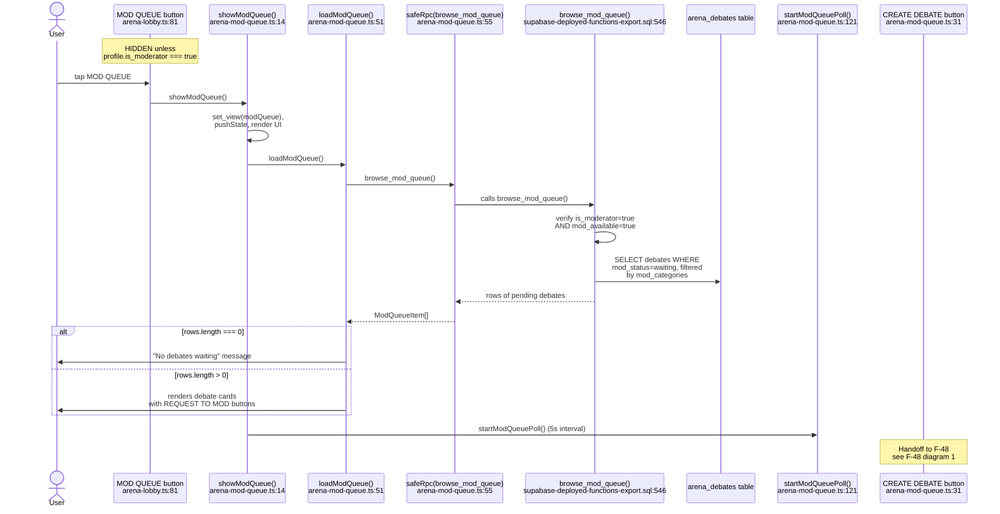
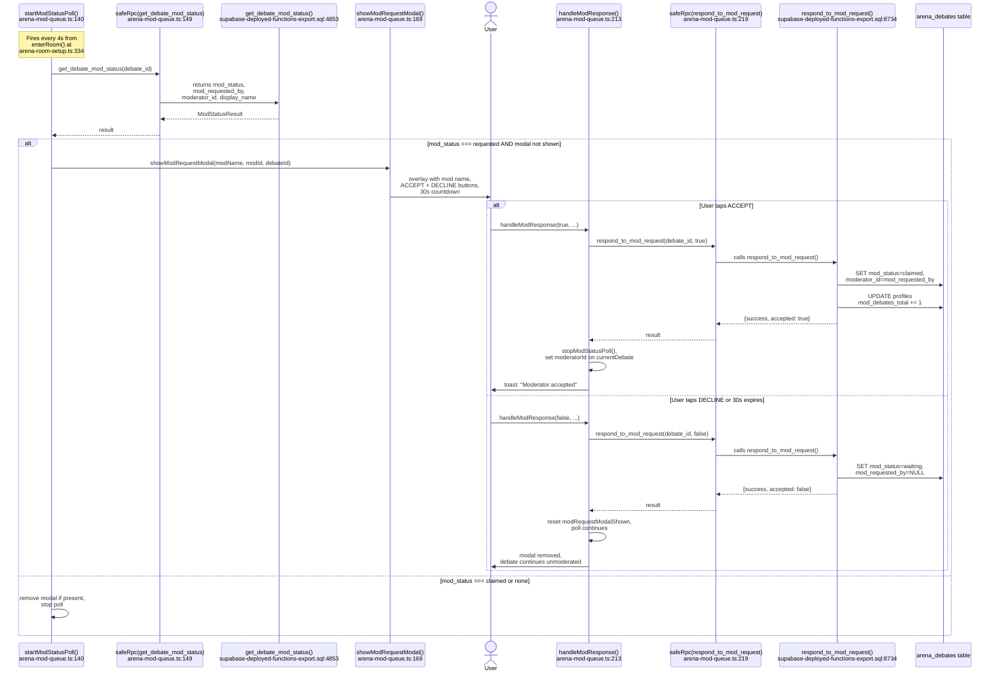

# F-47 — Moderator Marketplace — Interaction Map

## Summary

The Moderator Marketplace is the system that makes a user a moderator, gives moderators a queue of debates waiting for moderation, lets moderators claim debates, and provides post-debate scoring of moderator performance. All moderator state lives on the `profiles` table (`is_moderator`, `mod_available`, `mod_categories`, `mod_rating`, `mod_debates_total`, `mod_rulings_total`, `mod_approval_pct`). The Mod Queue screen is rendered by `src/arena/arena-mod-queue.ts` (240 lines), which handles browsing, claiming, and the debater-side mod-request modal. Post-debate scoring lives in `src/arena/arena-mod-scoring.ts` (81 lines) with the `score_moderator` RPC. The feature shipped in Session 179 with 8 test cases in `tests/f47-moderator-scoring.test.ts`. F-47 is the parent of F-48 (Mod-Initiated Debate) — the CREATE DEBATE button rendered inside the Mod Queue belongs to F-48's interaction map.

## User actions in this feature

1. **User becomes a moderator** — via the lobby recruitment banner or the Settings toggle
2. **Moderator enters the Mod Queue** — taps MOD QUEUE button in the arena lobby
3. **Moderator requests to moderate a debate** — taps REQUEST TO MOD on a queue card
4. **Debater responds to a mod request** — accepts or declines the modal that appears during a live debate
5. **Post-debate moderator scoring** — debaters rate thumbs-up/down, spectators use a 1-50 slider

---

## 1. User becomes a moderator

There are two paths to becoming a moderator. The primary discovery path is the recruitment banner in the arena lobby at `arena-lobby.ts:82-87`, which renders a "BECOME A MODERATOR" button when `is_moderator` is false and the user is logged in. The click handler at `arena-lobby.ts:126` calls `toggleModerator(true)` from `auth.ts:821`. The secondary path is the Settings page toggle at `settings.ts:376`, which also calls `toggleModerator()`.

`toggleModerator()` at `auth.ts:821` calls `safeRpc('toggle_moderator_status', { p_enabled })`. The RPC at `supabase-deployed-functions-export.sql:10356` sets `is_moderator = p_enabled` on the profile and conditionally clears `mod_available` when disabling. On success, the lobby re-renders via `renderLobby()` at `arena-lobby.ts:130`, replacing the recruitment banner with the MOD QUEUE button.



**Notes:**
- The recruitment banner at `arena-lobby.ts:82-87` is gated by `getCurrentUser() && !profile?.is_moderator` — guests never see it.
- The Settings page at `settings.ts:376` provides the same toggle via a checkbox (`set-mod-enabled`). On change, it calls `toggleModerator(enabled)` and reloads the moderator settings section via `loadModeratorSettings()` at `settings.ts:387`.
- The Settings page also has a second toggle for `mod_available` at `settings.ts:392`, which calls `toggleModAvailable()` at `auth.ts:844` and the `toggle_mod_available` RPC at `supabase-deployed-functions-export.sql:10327`. This controls whether the mod appears in browse results.
- `toggle_moderator_status` does NOT validate anything beyond authentication — any logged-in user can become a moderator. There is no application flow, approval process, or minimum criteria.
- The `guard_profile_columns` trigger at `guard-trigger-fix.sql:65` silently reverts direct client UPDATEs to `is_moderator`. The `toggle_moderator_status` RPC bypasses this because it runs as SECURITY DEFINER.
- A post-debate nudge at `arena-room-end.ts:262` also promotes moderator signup for non-moderator users via `nudge('become_moderator_post_debate', ...)`.

---

## 2. Moderator enters the Mod Queue

The MOD QUEUE button at `arena-lobby.ts:81` is conditionally rendered when `profile?.is_moderator` is true. Its click handler at `arena-lobby.ts:123` calls `showModQueue()` from `arena-mod-queue.ts:14`. `showModQueue()` sets the view to `modQueue`, pushes browser history, renders the queue screen with a BACK button and (for moderators) the CREATE DEBATE button, then calls `loadModQueue()` and starts a 5-second poll.



**Notes:**
- The BACK button at `arena-mod-queue.ts:30` stops the poll via `stopModQueuePoll()` at `arena-mod-queue.ts:133` and calls `renderLobby()`.
- The CREATE DEBATE button at `arena-mod-queue.ts:31` is gated by `profile?.is_moderator`. Its click handler and all subsequent logic belong to F-48 — see [F-48 Mod-Initiated Debate](./F-48-mod-initiated-debate.md) diagram 1.
- `browse_mod_queue()` at `supabase-deployed-functions-export.sql:546` requires both `is_moderator = true` AND `mod_available = true`. If `mod_available` is false, the RPC raises "Not an available moderator" and the client shows a message at `arena-mod-queue.ts:60`: "You're not set to Available. Toggle in Settings to receive requests."
- The queue is filtered by the moderator's `mod_categories` array. If `mod_categories` is NULL or empty, all categories are shown (`supabase-deployed-functions-export.sql:580-582`).
- The poll at `arena-mod-queue.ts:121` runs every 5 seconds and auto-stops if the view changes (`arena-mod-queue.ts:124`).
- Each queue card shows category, mode, topic, debater names, wait time, and a gold REQUEST TO MOD button at `arena-mod-queue.ts:86`.

---

## 3. Moderator requests to moderate a debate

The REQUEST TO MOD button at `arena-mod-queue.ts:86` fires `claimModRequest()` at `arena-mod-queue.ts:99` on click. This disables the button, calls `safeRpc('request_to_moderate', { p_debate_id })`, and on success stops the queue poll and shows a "Request sent. Waiting for the debaters to accept." message.

The `request_to_moderate` RPC at `supabase-deployed-functions-export.sql:8398` verifies the caller is an available moderator, locks the debate row with `FOR UPDATE SKIP LOCKED`, checks `mod_status = 'waiting'`, verifies the moderator is not a debater in the match, then sets `mod_status = 'requested'` and `mod_requested_by = caller`.

```mermaid
sequenceDiagram
    actor User
    participant ClaimBtn as REQUEST TO MOD button<br/>arena-mod-queue.ts:86
    participant ClaimFn as claimModRequest()<br/>arena-mod-queue.ts:99
    participant RPC as safeRpc(request_to_moderate)<br/>arena-mod-queue.ts:103
    participant SQL as request_to_moderate()<br/>supabase-deployed-functions-export.sql:8398
    participant Table as arena_debates table
    participant StopPoll as stopModQueuePoll()<br/>arena-mod-queue.ts:133
    participant ListEl as mod-queue-list DOM

    Note over ClaimBtn: ALWAYS ENABLED<br/>(no client-side disabled-state;<br/>server validates eligibility)
    User->>ClaimBtn: tap REQUEST TO MOD
    ClaimBtn->>ClaimFn: claimModRequest(debateId, btn)
    ClaimFn->>ClaimBtn: disabled = true, text = REQUESTING...
    ClaimFn->>RPC: request_to_moderate(p_debate_id)
    RPC->>SQL: calls request_to_moderate()
    SQL->>SQL: verify is_moderator=true,<br/>mod_available=true
    SQL->>Table: SELECT ... FOR UPDATE SKIP LOCKED
    SQL->>SQL: verify mod_status = waiting,<br/>caller is not a debater

    alt success
        SQL->>Table: UPDATE mod_status = requested,<br/>mod_requested_by = caller
        SQL-->>RPC: {success, debate_id, moderator_name}
        RPC-->>ClaimFn: success
        ClaimFn->>StopPoll: stopModQueuePoll()
        ClaimFn->>ListEl: "Request sent. Waiting for<br/>the debaters to accept."
        ListEl->>User: confirmation message
    else error (race condition)
        SQL-->>RPC: exception
        RPC-->>ClaimFn: error
        ClaimFn->>ClaimBtn: re-enable, text = REQUEST TO MOD
        ClaimFn->>User: toast: "Another mod got there<br/>first — queue refreshed"
        ClaimFn->>ClaimFn: loadModQueue() to refresh list
    end
```

**Notes:**
- The `FOR UPDATE SKIP LOCKED` at `supabase-deployed-functions-export.sql:8424` means if two moderators click simultaneously, one gets the lock and the other gets "Debate not available — already claimed by another moderator".
- The client handles the race gracefully at `arena-mod-queue.ts:108`: re-enables the button, shows a toast, and refreshes the queue list.
- The moderator cannot claim a debate they are participating in as a debater — `supabase-deployed-functions-export.sql:8434` guards against this.
- After a successful request, the moderator sees a static confirmation message. There is no poll to check if the debaters accepted or declined — the moderator must re-enter the Mod Queue to see updated state.

---

## 4. Debater responds to a mod request

When a debate has `mod_status = 'requested'`, debaters see a modal asking them to accept or decline the moderator. The detection mechanism is `startModStatusPoll()` at `arena-mod-queue.ts:140`, which fires from `enterRoom()` at `arena-room-setup.ts:333` for every non-AI, non-mod-view debate. The poll calls `get_debate_mod_status` every 4 seconds.

When the poll detects `mod_status === 'requested'`, it calls `showModRequestModal()` at `arena-mod-queue.ts:169`, which renders a full-screen overlay with the moderator's name, ACCEPT and DECLINE buttons, and a 30-second auto-decline countdown. Both buttons call `handleModResponse()` at `arena-mod-queue.ts:213`, which calls `respond_to_mod_request(p_debate_id, p_accept)`.



**Notes:**
- The 30-second countdown timer at `arena-mod-queue.ts:192-200` auto-fires `handleModResponse(false, ...)` on expiry, sending a decline to the server.
- The `modRequestModalShown` flag at `arena-mod-queue.ts:142` prevents the modal from re-rendering on every poll tick while already shown.
- Only debaters can respond — `respond_to_mod_request` at `supabase-deployed-functions-export.sql:8752` checks the caller is `debater_a` or `debater_b`.
- On accept, the mod's `mod_debates_total` is incremented at `supabase-deployed-functions-export.sql:8773`. This is separate from the scoring system.
- On decline, `mod_status` resets to `waiting` and `mod_requested_by` is cleared at `supabase-deployed-functions-export.sql:8793-8794`, making the debate available for other moderators to claim.
- The `get_debate_mod_status` RPC at `supabase-deployed-functions-export.sql:4864` reads the row WITHOUT `FOR UPDATE` — read-only, no lock contention.
- The poll auto-stops if the view changes away from `room` (`arena-mod-queue.ts:144`).
- `handleModResponse` silently swallows RPC errors at `arena-mod-queue.ts:221-224` — if the respond call fails, the modal is removed and `modRequestModalShown` is reset, but no toast is shown.

---

## 5. Post-debate moderator scoring

After a moderated debate ends, `renderPostDebate()` at `arena-room-end.ts:267` calls `renderModScoring()` from `arena-mod-scoring.ts:5` if `debate.moderatorId` and `debate.moderatorName` are present. The scoring UI differs by role: debaters see thumbs-up (score=25) and thumbs-down (score=0) buttons at `arena-mod-scoring.ts:23-24`, while spectators see a 1-50 slider at `arena-mod-scoring.ts:35` with a SUBMIT SCORE button.

Both paths call `scoreModerator()` at `auth.ts:923`, which calls `safeRpc('score_moderator', { p_debate_id, p_score })`. The RPC at `supabase-deployed-functions-export.sql:9525` validates the score range by role, inserts into `moderator_scores`, recalculates `mod_approval_pct` as a weighted average, and updates the moderator's profile.

```mermaid
sequenceDiagram
    participant PostDebate as renderPostDebate()<br/>arena-room-end.ts:267
    participant RenderFn as renderModScoring()<br/>arena-mod-scoring.ts:5
    actor User
    participant ScoreBtn as thumbs-up or thumbs-down<br/>arena-mod-scoring.ts:23
    participant Slider as score slider 1-50<br/>arena-mod-scoring.ts:35
    participant ScoreFn as scoreModerator()<br/>auth.ts:923
    participant RPC as safeRpc(score_moderator)<br/>auth.ts:926
    participant SQL as score_moderator()<br/>supabase-deployed-functions-export.sql:9525
    participant ScoreTable as moderator_scores table
    participant ProfTable as profiles table

    PostDebate->>RenderFn: renderModScoring(debate, container)
    RenderFn->>RenderFn: check moderatorId exists,<br/>caller is not the moderator

    alt caller is debater
        RenderFn->>User: thumbs-up (FAIR) and<br/>thumbs-down (UNFAIR) buttons
        User->>ScoreBtn: tap FAIR (score=25)<br/>or UNFAIR (score=0)
        ScoreBtn->>ScoreFn: scoreModerator(debateId, score)
    else caller is spectator
        RenderFn->>User: slider (1-50) + SUBMIT SCORE
        User->>Slider: adjust slider, tap SUBMIT
        Slider->>ScoreFn: scoreModerator(debateId, score)
    end

    ScoreFn->>RPC: score_moderator(p_debate_id, p_score)
    RPC->>SQL: calls score_moderator()
    SQL->>SQL: verify debate completed,<br/>mod assigned, caller is not mod
    SQL->>SQL: validate score range<br/>(debater: 0 or 25;<br/>spectator: 1-50)
    SQL->>ScoreTable: INSERT into moderator_scores
    SQL->>SQL: recalculate mod_approval_pct<br/>as weighted average
    SQL->>ProfTable: UPDATE mod_approval_pct
    SQL-->>RPC: {success, role, score, new_approval}
    RPC-->>ScoreFn: result
    ScoreFn-->>User: "Score submitted" confirmation
```

**Notes:**
- The moderator cannot score themselves — `arena-mod-scoring.ts:12` returns early if `profile.id === debate.moderatorId`, and the RPC double-checks at `supabase-deployed-functions-export.sql:9550`.
- Debater scores are binary: 25 (FAIR) or 0 (UNFAIR) — enforced server-side at `supabase-deployed-functions-export.sql:9556-9557`.
- Spectator scores use a continuous range 1-50 — enforced server-side at `supabase-deployed-functions-export.sql:9561-9562`.
- The approval calculation at `supabase-deployed-functions-export.sql:9569-9577` averages all scores for the moderator with `score * 2.0` scaling, producing a 0-100 percentage.
- The `moderator_scores` table has a unique constraint on `(debate_id, scorer_id)`, preventing double-scoring per user per debate.
- LM-194 applies: `record_mod_dropout` (a separate system for moderator no-shows) inserts a synthetic 0-score into the same `moderator_scores` table using `ON CONFLICT DO NOTHING`.

---

## Cross-references

- [F-48 Mod-Initiated Debate](./F-48-mod-initiated-debate.md) — F-47 is the parent. The CREATE DEBATE button rendered at `arena-mod-queue.ts:31` and its entire handler flow belong to F-48. The Mod Queue screen (`showModQueue()`) is the entry point that F-48 builds on.
- [F-01 Queue / Matchmaking](./F-01-queue-matchmaking.md) — shares the `arena_debates` table. The "Want a Moderator?" toggle in the queue config calls `request_mod_for_debate` on match confirmation (`arena-match.ts:170-171`), which sets `mod_status = 'waiting'` and makes the debate appear in the Mod Queue.
- [F-46 Private Lobby](./F-46-private-lobby.md) — private lobby debates can also request moderators via the same `request_mod_for_debate` path, surfacing them in the Mod Queue.

## Known quirks

- **No feedback loop for moderator after requesting.** After `claimModRequest()` succeeds at `arena-mod-queue.ts:113`, the moderator sees a static "Request sent" message. There is no poll to detect whether the debaters accepted or declined. The moderator must manually return to the Mod Queue and browse again. This means a declined request produces zero notification to the requesting moderator.
- **`handleModResponse` silently swallows RPC errors.** At `arena-mod-queue.ts:221-224`, if `respond_to_mod_request` fails, the modal is removed and `modRequestModalShown` is reset, but no toast or error indicator is shown to the debater. The moderator's request slot may remain in `requested` state if the decline never reaches the server.
- **`startModStatusPoll` empty catch block.** At `arena-mod-queue.ts:158`, the poll's try/catch has an empty catch (`catch { /* retry next tick */ }`). If `get_debate_mod_status` fails repeatedly (e.g., network issues), the debater gets no indication of the problem — the poll just silently retries.
- **30-second auto-decline is client-side only.** The countdown at `arena-mod-queue.ts:196-199` fires `handleModResponse(false, ...)` after 30 seconds. If the client goes offline or the tab is backgrounded, the timer may stall, leaving the debate in `requested` state indefinitely until someone else acts.
- **`browse_mod_queue` requires `mod_available = true` but `request_to_moderate` also independently checks.** Both RPCs validate `is_moderator AND mod_available` (`supabase-deployed-functions-export.sql:558` and `supabase-deployed-functions-export.sql:8412`). This is belt-and-suspenders, not a bug, but means a moderator who toggles `mod_available` to false between browsing and clicking REQUEST TO MOD will get an error even though they just saw the queue.
- **`is_moderator` client-side gating without server validation on some paths.** The MOD QUEUE button at `arena-lobby.ts:81` and the recruitment banner at `arena-lobby.ts:82` use client-side `profile?.is_moderator` checks. However, both paths immediately call server RPCs that re-validate moderator status, so there is no security gap — just a UX gate.
- **`guard_profile_columns` trigger now protects `is_moderator`.** The `guard-trigger-fix.sql:65` migration (Session 214) added `NEW.is_moderator := OLD.is_moderator` to the trigger, meaning direct client UPDATEs to `is_moderator` are silently reverted. All changes must go through `toggle_moderator_status` (SECURITY DEFINER). However, per LM-085 and LM-171, other mod stats (`mod_rating`, `mod_approval_pct`, etc.) are NOT trigger-protected — they rely on RLS + SECURITY DEFINER RPCs.
