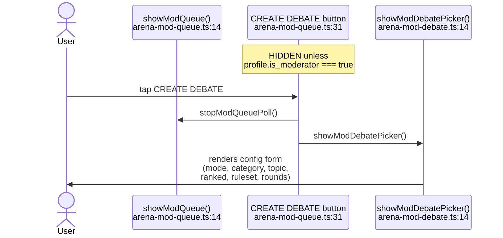
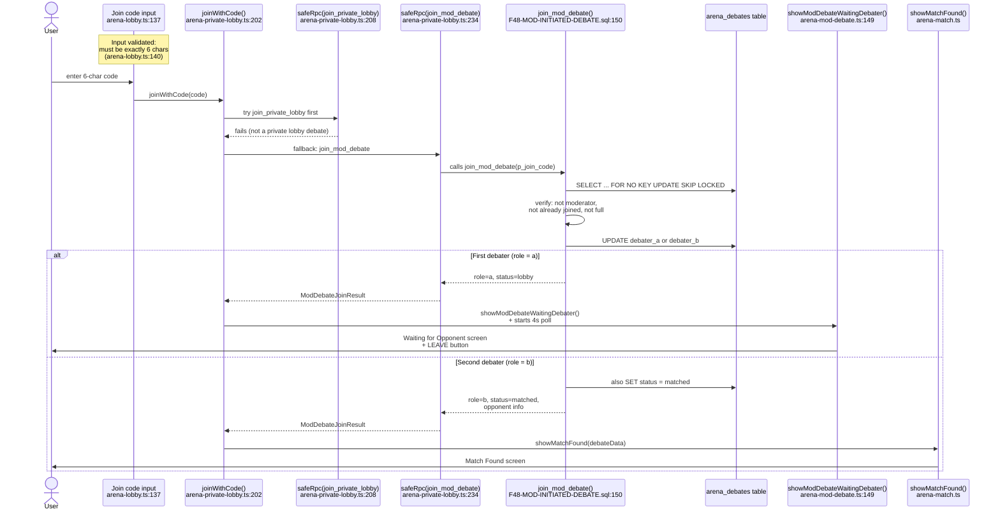
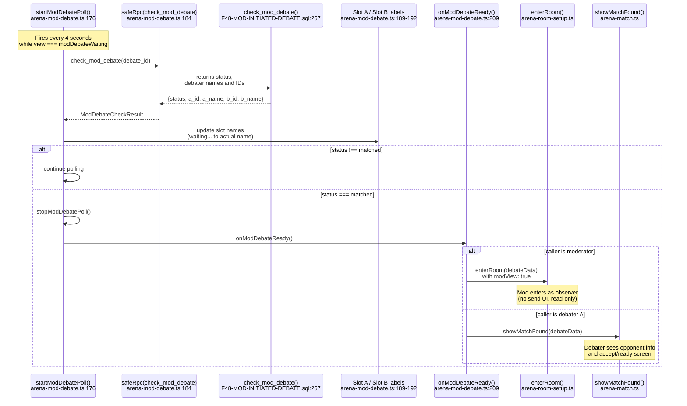
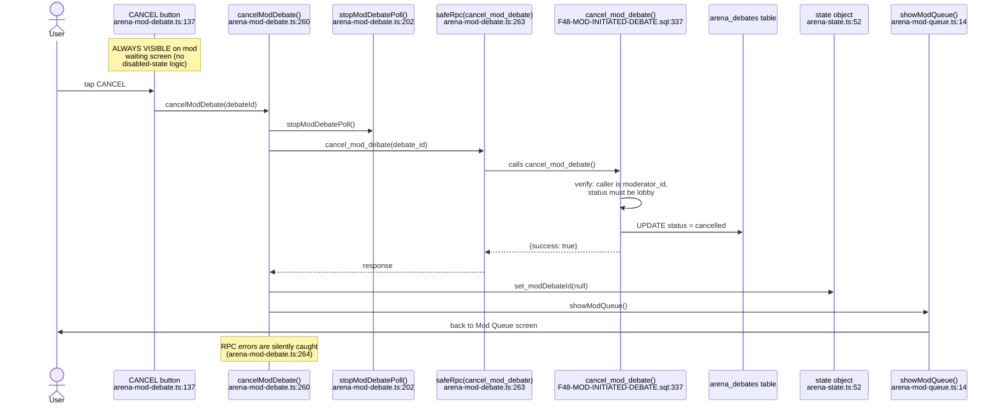

# F-48 — Mod-Initiated Debate — Interaction Map

## Summary

Mod-Initiated Debate lets a moderator create a debate from the Mod Queue, generating a 6-character join code that two debaters use to enter the match. The moderator configures mode, category, topic, ranked/unranked, ruleset, and round count, then waits while debaters join via the code. Once both debater slots fill, the moderator enters the debate room as an observer and both debaters see the match-found screen. The feature shipped in Session 210, with a round-count picker added later via `round-count-picker-migration.sql`. All client logic lives in `src/arena/arena-mod-debate.ts` (268 lines), with the join-code fallback path in `src/arena/arena-private-lobby.ts`. The four RPCs (`create_mod_debate`, `join_mod_debate`, `check_mod_debate`, `cancel_mod_debate`) are defined in `F48-MOD-INITIATED-DEBATE.sql`. Note: the original SQL hardcodes `total_rounds = 3` but a later migration (`round-count-picker-migration.sql:492`) added a `p_total_rounds` parameter; the deployed function accepts it.

## User actions in this feature

1. **Moderator opens Create Debate picker** — from the Mod Queue, taps CREATE DEBATE
2. **Moderator configures and creates the debate** — fills the picker form, taps CREATE & GET CODE
3. **Debater joins via join code** — enters code in the lobby's join-code input
4. **Match ready — both debaters joined** — auto-detected by the 4-second poll; mod enters observer mode, debaters get match-found screen
5. **Moderator cancels** — taps CANCEL on the waiting screen before match completes

---

## 1. Moderator opens Create Debate picker

The CREATE DEBATE button lives in `showModQueue()` at `arena-mod-queue.ts:31`. It is only rendered if `profile?.is_moderator` is true — non-moderators never see the button. On click (handler at `arena-mod-queue.ts:42`), the mod queue poll is stopped and `showModDebatePicker()` is called, which replaces the screen content with the configuration form.



**Notes:**
- The CREATE DEBATE button uses gold accent styling (`border-color:var(--mod-accent-primary)`) to distinguish it from normal secondary buttons — `arena-mod-queue.ts:31`.
- The BACK button at `arena-mod-queue.ts:30` also stops the mod queue poll and returns to the lobby via `renderLobby()`.
- `showModDebatePicker()` pushes `arenaView: 'modDebatePicker'` to browser history at `arena-mod-debate.ts:16`, enabling back-button navigation.

---

## 2. Moderator configures and creates the debate

The picker form has six controls: Mode select (`arena-mod-debate.ts:31`), Category select (`arena-mod-debate.ts:40`), Topic text input (`arena-mod-debate.ts:53`), Ranked checkbox (`arena-mod-debate.ts:58`), Ruleset select (`arena-mod-debate.ts:64`), and a round-count picker (`arena-mod-debate.ts:70-71`, imported from `arena-config-settings.ts`). The CREATE & GET CODE button at `arena-mod-debate.ts:73` calls `createModDebate()` at `arena-mod-debate.ts:88` on click.

`createModDebate()` disables the button, reads all form values, and calls `safeRpc('create_mod_debate', ...)`. The RPC (`F48-MOD-INITIATED-DEBATE.sql:40`) verifies the caller is a moderator, generates a unique 6-char join code, inserts an `arena_debates` row with both debater slots NULL, and returns `debate_id` + `join_code`. On success, the client calls `showModDebateWaitingMod()` to display the waiting screen with the join code.

```mermaid
sequenceDiagram
    actor User
    participant CreateBtn as CREATE and GET CODE button<br/>arena-mod-debate.ts:73
    participant CreateFn as createModDebate()<br/>arena-mod-debate.ts:88
    participant RPC as safeRpc(create_mod_debate)<br/>arena-mod-debate.ts:99
    participant SQL as create_mod_debate()<br/>F48-MOD-INITIATED-DEBATE.sql:40
    participant Table as arena_debates table
    participant State as state object<br/>arena-state.ts:52
    participant Waiting as showModDebateWaitingMod()<br/>arena-mod-debate.ts:117

    Note over CreateBtn: ALWAYS ENABLED<br/>(no disabled-state logic;<br/>all fields have defaults)
    User->>CreateBtn: tap CREATE and GET CODE
    CreateBtn->>CreateFn: fires
    CreateFn->>CreateBtn: disabled = true, text = Creating...
    CreateFn->>RPC: POST with mode, topic, category,<br/>ranked, ruleset, total_rounds
    RPC->>SQL: calls create_mod_debate()
    SQL->>SQL: verify is_moderator = true
    SQL->>SQL: generate 6-char join code<br/>(retry up to 10x on collision)
    SQL->>Table: INSERT row: debater_a=NULL,<br/>debater_b=NULL, status=lobby,<br/>mod_status=claimed, visibility=code
    SQL-->>RPC: debate_id + join_code
    RPC-->>CreateFn: {debate_id, join_code}
    CreateFn->>State: set_modDebateId(debate_id)
    CreateFn->>Waiting: showModDebateWaitingMod(debateId,<br/>joinCode, topic, mode, ranked)
    Waiting->>User: shows join code + slot names<br/>(both waiting...) + CANCEL button

    Note over CreateFn: On error: re-enables button,<br/>showToast with friendlyError
```

**Notes:**
- The CREATE & GET CODE button has no disabled-state logic — all form fields have defaults (mode=text, category=Any, topic=blank, ranked=false, ruleset=amplified, rounds=default). The button is always clickable once rendered.
- The SQL function validates `mode` and `ruleset` values server-side and silently corrects invalid values to defaults (`arena-mod-debate.ts` line 92-96 read the select values; `F48-MOD-INITIATED-DEBATE.sql:71-78` enforce valid values).
- The `p_total_rounds` parameter was added by `round-count-picker-migration.sql:492` after F-48 shipped. The original SQL hardcoded `total_rounds = 3`. The client passes `selectedRounds` at `arena-mod-debate.ts:105`.
- The join code generation loop at `F48-MOD-INITIATED-DEBATE.sql:81-92` retries up to 10 times on collision with active debates (status IN lobby/matched/live). Uses `md5(random() || clock_timestamp())`.
- LM-200 applies here: the `stamp_debate_language` trigger fires on INSERT but reads `profiles WHERE id = NEW.debater_a`. Since `debater_a` is NULL for mod-created debates, the trigger must handle the NULL case to avoid stamping a wrong language.

---

## 3. Debater joins via join code

Debaters enter the 6-character code in the lobby's join-code input at `arena-lobby.ts:137`. The input fires `joinWithCode()` at `arena-private-lobby.ts:202` on button click (`arena-lobby.ts:138`) or Enter keypress (`arena-lobby.ts:143`). `joinWithCode()` first tries `join_private_lobby` (the F-46 RPC for direct challenges). When that fails — as it will for mod-created debates — the catch block falls back to `join_mod_debate` at `arena-private-lobby.ts:234`.

The `join_mod_debate` RPC (`F48-MOD-INITIATED-DEBATE.sql:150`) locks the row with `FOR NO KEY UPDATE SKIP LOCKED` for race safety, fills the first empty slot (debater_a if NULL, else debater_b), and sets status to `matched` when both slots are filled. If the joiner is the first debater (role=a, status stays `lobby`), the client shows `showModDebateWaitingDebater()` with a LEAVE button. If the joiner is the second debater (role=b, status=`matched`), the client goes straight to `showMatchFound()`.



**Notes:**
- The join-code input only fires `joinWithCode()` when the trimmed value is exactly 6 characters (`arena-lobby.ts:140`). Shorter codes show a toast "Enter a 6-character code" (`arena-lobby.ts:141`).
- The fallback from `join_private_lobby` to `join_mod_debate` is silent — no error toast on the first failure. Toast only fires if both RPCs fail (`arena-private-lobby.ts:265`).
- `join_mod_debate` uses `FOR NO KEY UPDATE SKIP LOCKED` (`F48-MOD-INITIATED-DEBATE.sql:186`) to prevent race conditions when two debaters enter the code simultaneously.
- Guards in the SQL: caller cannot be the moderator (`F48-MOD-INITIATED-DEBATE.sql:193`), cannot already be in a slot (`F48-MOD-INITIATED-DEBATE.sql:198`), debate cannot be full (`F48-MOD-INITIATED-DEBATE.sql:221`).
- The first-joiner waiting screen (`showModDebateWaitingDebater()` at `arena-mod-debate.ts:149`) shows a LEAVE button at line 163. Tapping LEAVE stops the poll and returns to the lobby — it does NOT call `cancel_mod_debate` (only the moderator can cancel).

---

## 4. Match ready — both debaters joined

The 4-second poll (`startModDebatePoll()` at `arena-mod-debate.ts:176`) runs on both the moderator's waiting screen and the first-joiner debater's waiting screen. It calls `check_mod_debate` (`F48-MOD-INITIATED-DEBATE.sql:267`) which returns slot status and debater names. When `status === 'matched'`, the poll stops and `onModDebateReady()` at `arena-mod-debate.ts:209` fires.

`onModDebateReady()` checks whether the current user is the moderator (i.e., not debater_a and not debater_b). If moderator: enters the debate room via `enterRoom()` with `modView: true` (observer mode). If debater (first-joiner, role=a): goes to `showMatchFound()` with opponent info.



**Notes:**
- The poll guard at `arena-mod-debate.ts:179` checks `view !== 'modDebateWaiting'` and auto-stops if the user navigated away. This prevents orphan polls.
- Slot name updates at `arena-mod-debate.ts:189-192` only fire on the moderator's waiting screen (the debater waiting screen doesn't have `#slot-a-name` / `#slot-b-name` elements). This is harmless — `getElementById` returns null and the assignment is skipped.
- `onModDebateReady()` distinguishes mod from debater by checking if the current profile ID matches neither `debater_a_id` nor `debater_b_id` (`arena-mod-debate.ts:211`). This works because the moderator is stored in `moderator_id`, not in a debater slot.
- The moderator's `CurrentDebate` object includes `modView: true` and both `debaterAName` / `debaterBName` properties (`arena-mod-debate.ts:231-233`), which the debate room uses to render observer-mode labels.
- `check_mod_debate` SQL at `F48-MOD-INITIATED-DEBATE.sql:300-305` guards that only the moderator or one of the debaters can poll — prevents other users from snooping on the debate status.

---

## 5. Moderator cancels

The CANCEL button lives on the moderator's waiting screen at `arena-mod-debate.ts:137`. The handler at line 142 calls `cancelModDebate()` at `arena-mod-debate.ts:260`, which stops the poll, calls `cancel_mod_debate` RPC, clears `modDebateId`, and returns to the Mod Queue.



**Notes:**
- The CANCEL button has no disabled-state logic — it's always visible and clickable on the moderator's waiting screen. The only guard is server-side: `cancel_mod_debate` checks `status = 'lobby'` (`F48-MOD-INITIATED-DEBATE.sql:367`). If the debate has already matched, the cancel silently fails (caught by the empty catch at `arena-mod-debate.ts:264`).
- The debater's waiting screen has a LEAVE button instead (`arena-mod-debate.ts:163`), which does NOT call `cancel_mod_debate` — it only stops the poll and returns to the lobby. The debate remains open for other debaters to join.
- Cancel uses `FOR NO KEY UPDATE` row locking (`F48-MOD-INITIATED-DEBATE.sql:355`) to prevent race conditions with a debater joining at the same moment.

---

## Cross-references

- [F-46 Private Lobby](./F-46-private-lobby.md) — provides the `joinWithCode()` entry point that F-48 piggybacks on. The join-code input in the lobby, the `join_private_lobby` RPC, and the fallback-to-`join_mod_debate` path all live in `arena-private-lobby.ts`.
- [F-47 Moderator Marketplace](./F-47-moderator-marketplace.md) — provides the Mod Queue screen (`arena-mod-queue.ts`) and the `is_moderator` gating. The CREATE DEBATE button is rendered inside `showModQueue()`.
- [F-01 Queue / Matchmaking](./F-01-queue-matchmaking.md) — shared `arena_debates` table and `enterRoom()` flow. F-48's `onModDebateReady()` merges into the same debate room as queue-matched debates.

## Known quirks

- The original F-48 SQL migration (`F48-MOD-INITIATED-DEBATE.sql:122`) hardcodes `total_rounds = 3`, but the round-count picker migration (`round-count-picker-migration.sql:492`) later overwrote `create_mod_debate` to accept `p_total_rounds` with a default of 4. The client sends `selectedRounds` (`arena-mod-debate.ts:105`). The deployed function (visible in `supabase-deployed-functions-export.sql:2936`) uses the updated version with `p_total_rounds`. The original SQL file in the repo is stale on this point.
- The `check_mod_debate` return type in the SQL (`F48-MOD-INITIATED-DEBATE.sql:270-277`) does not include `total_rounds` or `language`, but the TypeScript interface `ModDebateCheckResult` (`arena-types.ts:200`) expects both fields. These were added by later migrations. The original SQL file is stale.
- `cancelModDebate()` silently swallows RPC errors (`arena-mod-debate.ts:264`). If the cancel fails (e.g., debate already matched), the moderator is returned to the Mod Queue with no feedback that the cancel didn't work.
- The debater LEAVE button (`arena-mod-debate.ts:168-171`) only stops the poll and navigates away — it does not notify the server. The debater's slot remains filled in `arena_debates`. If debater A leaves and debater B joins, the debate becomes `matched` with debater A absent.
- LM-200: `stamp_debate_language` trigger reads `profiles WHERE id = NEW.debater_a`, but `create_mod_debate` inserts with `debater_a = NULL`. The trigger must handle the NULL case; if it doesn't, the debate may get an incorrect language stamp.
