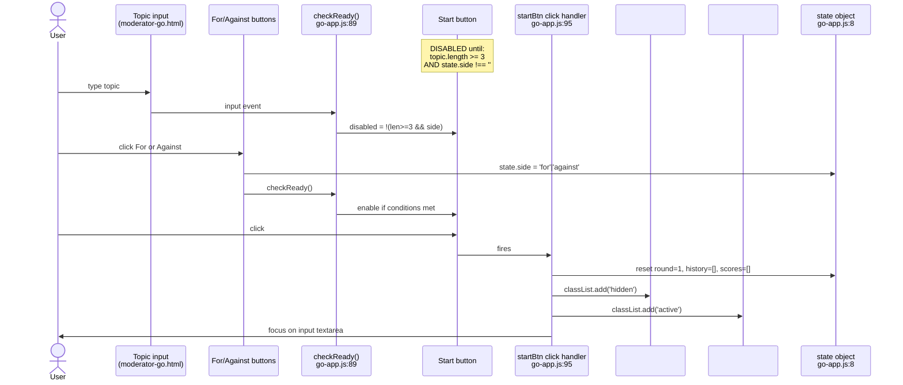
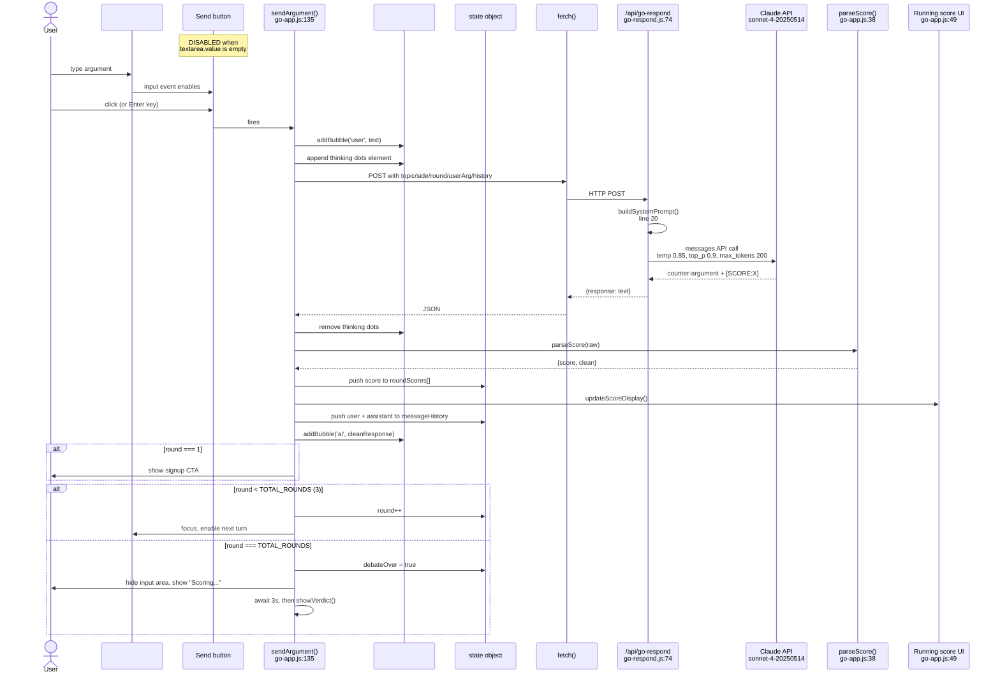
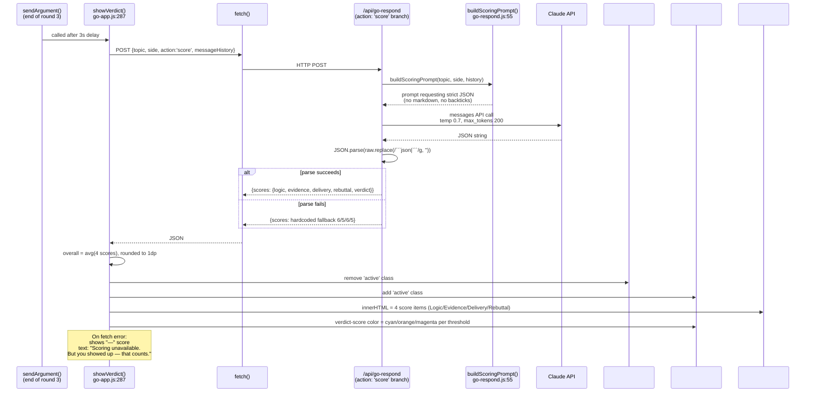

# F-49 — `/go` Guest AI Sparring — Interaction Map

> **Status:** SHIPPED (S206, AI provider swapped Groq → Claude in S208)
> **Scope:** Standalone landing page at `themoderator.app/go`. No auth. No DB. Ephemeral.
> **Files:**
> - `moderator-go.html` — three screens (setup / debate / verdict) in one file, hidden via CSS classes
> - `moderator-go-app.js` — all client logic, 351 lines, one shared `state` object
> - `api/go-respond.js` — Vercel serverless function, 195 lines, proxies to Claude API
>
> **Landmine:** punch list describes F-49 as calling Groq with `GROQ_API_KEY`. This is stale. Actual code (S208) calls Claude Sonnet 4 (`claude-sonnet-4-20250514`) with `ANTHROPIC_API_KEY` set in Vercel env. Worth a doc sweep.

---

## User actions in this feature

Three distinct interactions drive the whole flow. Each gets its own diagram below.

1. **Setup → Start debate** — user types topic, picks side, taps Start
2. **Send argument** — main debate loop, repeats per round
3. **Final verdict** — auto-fires after round 3's AI response

---

## 1. Setup → Start Debate

The Start button lives on the setup screen and is **disabled by default**. Two conditions must both be true for it to light up: topic text length ≥ 3 characters AND a side has been picked. Logic lives in `checkReady()` at `moderator-go-app.js:89` — called on every `input` event on the topic field and after every side-picker click.



**Notes:**
- `state.side` is an empty string at init, which is why the `!state.side` check disables Start.
- Side picker uses `data-selected` attribute for CSS styling, not a class — grep for `data-selected` if you're hunting the gold-fill CSS.
- No server call on Start. Everything is local until the user sends their first argument.

---

## 2. Send Argument (per round)

The core loop. Fires on Send button click OR Enter keypress (without Shift) in the textarea. Sends user text + full message history to the serverless handler, which calls Claude Sonnet 4, parses a `[SCORE:X]` marker out of the response, updates a running score display, and either advances to the next round or triggers the verdict.



**Notes:**
- Send button disable logic: `sendBtn.disabled = !userInput.value.trim()` on every keystroke (line 131).
- Mic button (`#mic`) is **entirely hidden** if the browser has no `SpeechRecognition` support — `initSpeech()` at line 237 sets `style.display = 'none'`. Not disabled, hidden.
- Running score pip colors: cyan (≥7), orange (≥5), magenta (<5). Set via inline `style.color` AND pip class names `filled-high/mid/low`. Both places need to match if you retheme.
- `[SCORE:X]` marker regex is `/\[SCORE:\s*(\d+\.?\d*)\s*\]/i`. The marker is stripped from the text the user sees — clean version goes in history.
- If fetch fails (network or non-200), thinking dots are removed and a canned "Something went wrong. Try again." bubble is added. Debate state is NOT reset — user can try again.
- Final-round hint: on round 3, the user's message gets a hidden suffix `[This is the final round. Make your closing argument count.]` appended before sending (line 153). The user never sees this.

---

## 3. Final Verdict

Fires automatically after the round-3 AI response, via a 3-second delay inside `sendArgument()`. Hits the same `/api/go-respond` endpoint but with `action: 'score'` — the handler branches on this and calls Claude a second time with a different prompt (`buildScoringPrompt`), expecting a JSON object back.



**Notes:**
- The scoring prompt EXPLICITLY demands no markdown and no backticks, but the handler still runs `.replace(/```json|```/g, '')` defensively before parsing. Belt-and-suspenders.
- Hardcoded fallback scores (6/5/6/5) only fire on a successful Claude response that fails JSON parse — not on a network failure. Network failure goes through the `catch` block and shows the "—" screen.
- The Retry button (`#retry`) resets everything back to the setup screen — full state reset including `topic`, `side`, `roundScores`, and the button `data-selected` attributes. Doesn't reload the page.

---

## Cross-references

- **F-32 AI Judge (shipped)** — uses a nearly identical 4-criteria scorecard (Logic / Evidence / Delivery / Rebuttal) but at `supabase/functions/ai-sparring/index.ts:67`, scale 1-10 per criterion. F-49's scoring prompt is a cousin of F-32's `buildScoringPrompt()`. They share a lineage but are not the same file.
- **F-51 Live Moderated Debate Feed** — uses 1-5 per comment (not 1-10 per criterion). Scale incoherence is documented, not a bug.
- **Not connected to:** the main app's auth, DB, RPCs, or any Supabase infrastructure. `/go` is intentionally a dead-end marketing funnel with a signup CTA after round 1.

## Known quirks

- The file header comments in `api/go-respond.js` still say "Session 206 | Session 208: Swapped Groq → Claude API" — accurate. But the punch list description of F-49 still says Groq. The punch list is stale. One of them should be updated next doc sweep.
- There is no test coverage on this feature. No integration tests hit `/go` or `/api/go-respond`.
- CORS on the handler is locked to `https://themoderator.app` only — if you ever front the API from another domain (e.g., a preview deployment), the handler will silently reject it.
