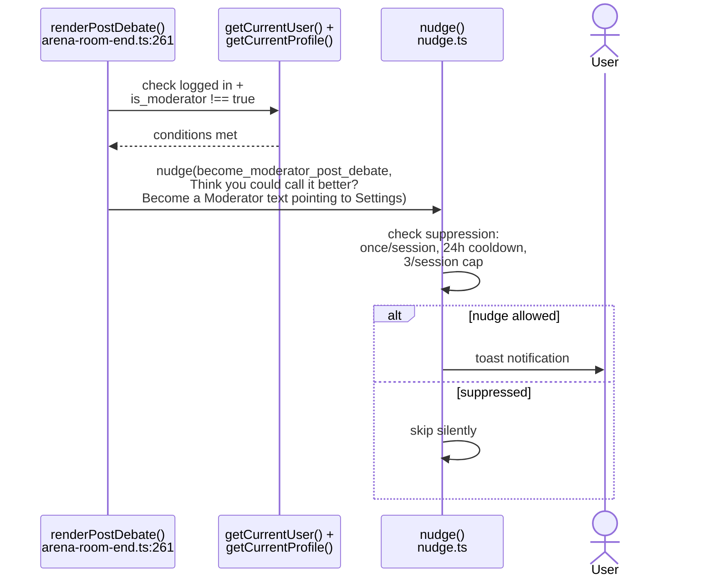
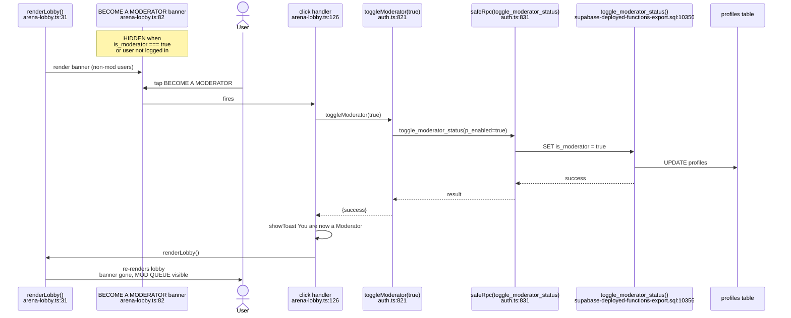
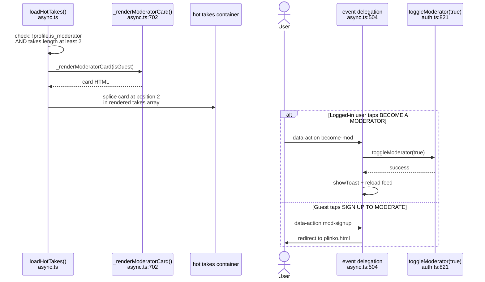
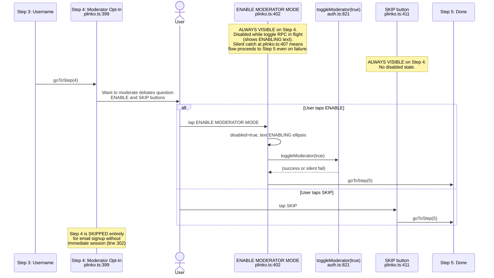

# F-50 — Moderator Discovery — 5 Touchpoints — Interaction Map

## Summary

Moderator Discovery is a set of 5 scattered touchpoints that promote the moderator role across the app. The app is called "The Moderator" — the role should be front and center. All 5 touchpoints are gated: they only appear for logged-in non-moderators and disappear once `is_moderator` becomes true. Three touchpoints offer one-tap moderator enablement via `toggleModerator(true)` from `auth.ts:821` (which calls the `toggle_moderator_status` RPC from F-47). Two are passive (nudge toast and Plinko step). The touchpoints are: (1) Post-debate nudge toast via `nudge.ts`, (2) Arena lobby inline banner with BECOME A MODERATOR button, (3) Home feed moderator card at position 2 in hot takes, (4) Plinko signup step 4 with opt-in/skip buttons, (5) Newsletter "Moderator Spotlight" section (server-side, in `newsletter.ts` on VPS — not in the client codebase). Feature shipped in Session 206, with the Plinko step making signup 5 steps (mod opt-in before Done).

## User actions in this feature

1. **Post-debate moderator nudge** — toast appears after a debate for non-moderators
2. **Arena lobby recruitment banner** — inline banner with one-tap BECOME A MODERATOR
3. **Home feed moderator card** — injected at position 2 in the hot takes feed
4. **Plinko signup step 4 — moderator opt-in** — opt-in or skip during signup

---

## 1. Post-debate moderator nudge

After a debate ends, `renderPostDebate()` at `arena-room-end.ts:261` checks if the user is logged in and not already a moderator. If both conditions hold, it fires `nudge('become_moderator_post_debate', ...)` at `arena-room-end.ts:263`. The nudge module at `src/nudge.ts` handles suppression: once per session per ID, 24-hour cooldown, and 3-per-session cap. If all suppression checks pass, a toast appears with the message directing the user to Settings.

**Notes:**
- This is a passive touchpoint — it directs the user to Settings rather than offering one-tap enablement. The user must navigate to Settings and toggle moderator status there.
- The nudge fires after every non-moderator debate (not just the first), but suppression rules limit it to once per session for this nudge ID.
- The `nudge()` function is from F-35's nudge toast system (`src/nudge.ts`).

---

## 2. Arena lobby recruitment banner

The BECOME A MODERATOR banner at `arena-lobby.ts:82-87` is rendered inline in the lobby HTML when `getCurrentUser() && !profile?.is_moderator`. It includes a banner with the text "THE MODERATOR NEEDS MODERATORS" and a BECOME A MODERATOR button. The click handler at `arena-lobby.ts:126` calls `toggleModerator(true)` from `auth.ts:821`, which fires `toggle_moderator_status` RPC. On success, it shows a success toast and calls `renderLobby()` to re-render — the banner disappears because `is_moderator` is now true.

**Notes:**
- This is the same banner documented in F-47's "User becomes a moderator" action. It is listed under F-50 because the discovery placement strategy is F-50's purpose.
- The banner uses cyan (`var(--mod-cyan)`) border and text to distinguish it from the gold accent used by other elements.
- Guest users never see the banner — gated by `getCurrentUser()` at `arena-lobby.ts:82`.

---

## 3. Home feed moderator card

The hot takes feed in `src/async.ts` injects a moderator recruitment card at position 2 (after the 2nd hot take). At `async.ts:641-644`, after rendering the hot takes array, if the profile is not a moderator and there are at least 2 takes, `_renderModeratorCard()` at `async.ts:702` is spliced into position 2.

The card renders "MODERATORS WANTED" with a BECOME A MODERATOR button (for logged-in users) or "SIGN UP TO MODERATE" (for guests). The button's `data-action` is `become-mod` or `mod-signup` respectively. The event delegation handler at `async.ts:504` calls `toggleModerator(true)` for `become-mod` and redirects to Plinko for `mod-signup`.

**Notes:**
- The card uses cyan styling (matching the lobby banner) — `border:1px solid var(--mod-cyan)` at `async.ts:707`.
- The card is only injected if there are at least 2 takes in the feed at `async.ts:643`. Fewer takes = no moderator card.
- After successful toggle, the feed is reloaded via `loadHotTakes(currentFilter)` at `async.ts:508`, which causes the moderator card to disappear on re-render.
- The `toggleModerator(true)` error handling at `async.ts:505` uses `.then()` — no catch block. If the RPC fails, no error is shown to the user.

---

## 4. Plinko signup step 4 — moderator opt-in

The Plinko signup flow (5 steps: OAuth/Email → Age → Username → Moderator Opt-In → Done) includes step 4 at `plinko.ts:399` as the moderator opt-in. Two buttons: "ENABLE MODERATOR MODE" (`btn-enable-mod`) and "SKIP" (`btn-skip-mod`). Tapping enable calls `toggleModerator(true)` at `plinko.ts:406`. The catch block at `plinko.ts:407` is empty (`catch { /* non-critical */ }`) — regardless of success or failure, the flow proceeds to step 5.

**Notes:**
- Step 4 is skipped for email signups where Supabase doesn't return an immediate session (email confirmation required) — at `plinko.ts:302`, the flow jumps directly to a modified step 5 asking the user to check their email.
- The `toggleModerator` catch at `plinko.ts:407` is empty: `catch { /* non-critical — proceed to step 5 regardless */ }`. If the RPC fails, the user proceeds thinking they're a moderator, but `is_moderator` remains false.
- The newsletter "Moderator Spotlight" (touchpoint 5 per the punch list) lives in `newsletter.ts` on the VPS, not in the client codebase. It's a server-side email template and is not mapped here.

---

## Cross-references

- [F-47 Moderator Marketplace](./F-47-moderator-marketplace.md) — F-50's touchpoints all funnel into F-47's `toggleModerator(true)` / `toggle_moderator_status` RPC. F-47 owns the moderator state and the Mod Queue that becomes visible after enablement.

## Known quirks

- **Home feed moderator card has no error handling on toggle.** At `async.ts:505`, `toggleModerator(true).then(...)` has no `.catch()`. If the RPC fails, the user gets no error feedback — the card just stays visible.
- **Plinko step 4 silently swallows toggle failure.** At `plinko.ts:407`, `catch { /* non-critical */ }` means if `toggleModerator` fails during signup, the user proceeds to step 5 without becoming a moderator. They'll never see the mod opt-in again (it's a one-time signup flow).
- **Post-debate nudge directs to Settings, not one-tap.** Unlike the lobby banner and home feed card (which call `toggleModerator` directly), the post-debate nudge at `arena-room-end.ts:263` just says "Become a Moderator → Settings" — requiring the user to navigate manually. This is a weaker conversion path.
- **Newsletter Moderator Spotlight (touchpoint 5) is VPS-only.** The newsletter template with mod stats runs server-side via `newsletter.ts` on the VPS. It's not in the client codebase and cannot be verified against repo files.
