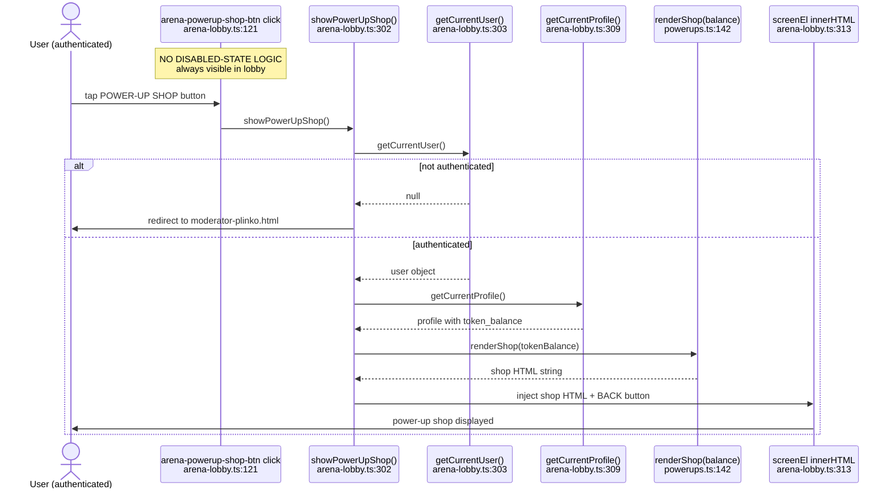
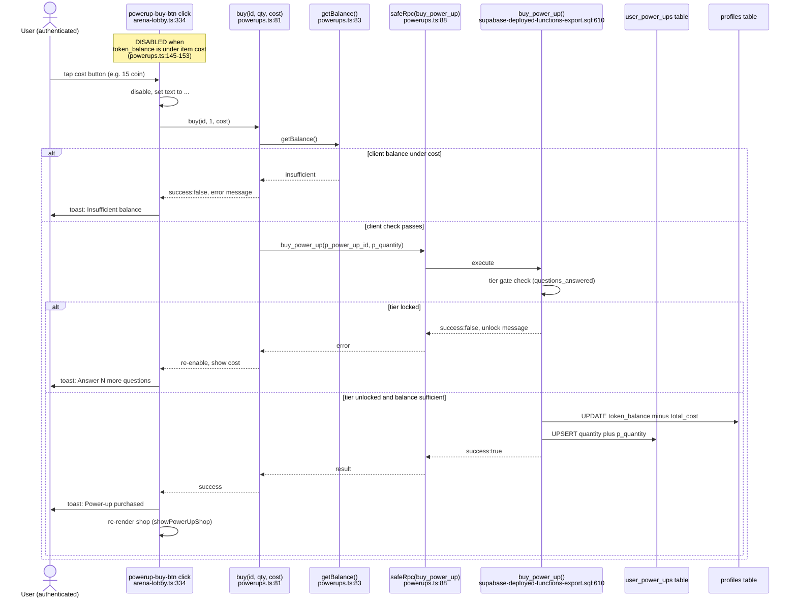
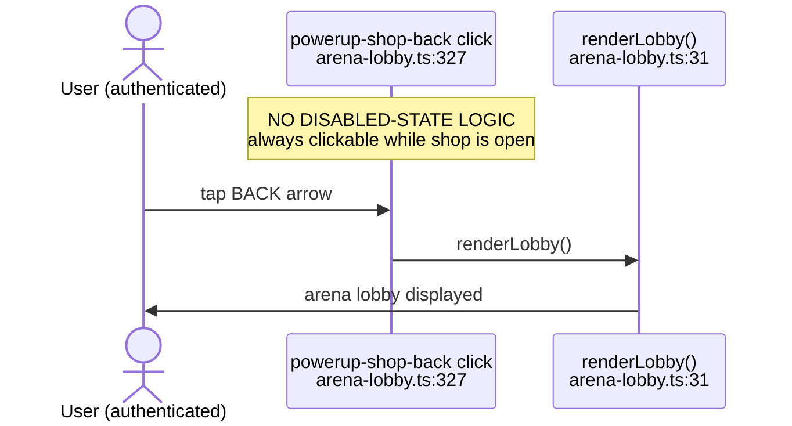
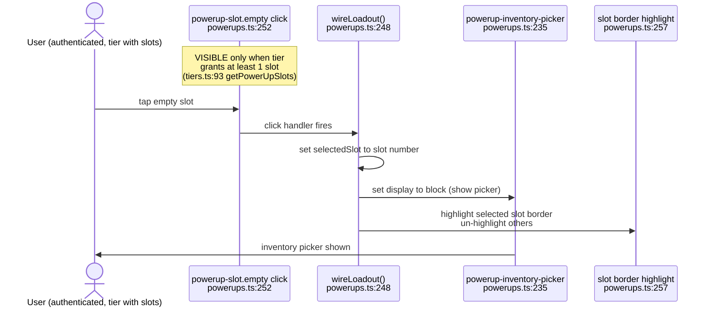
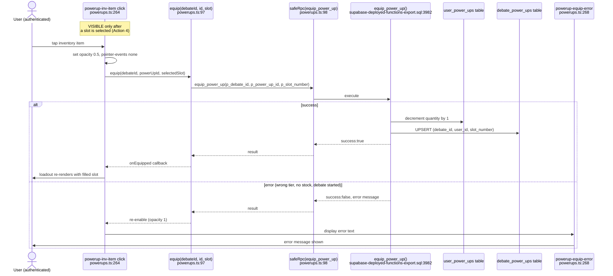
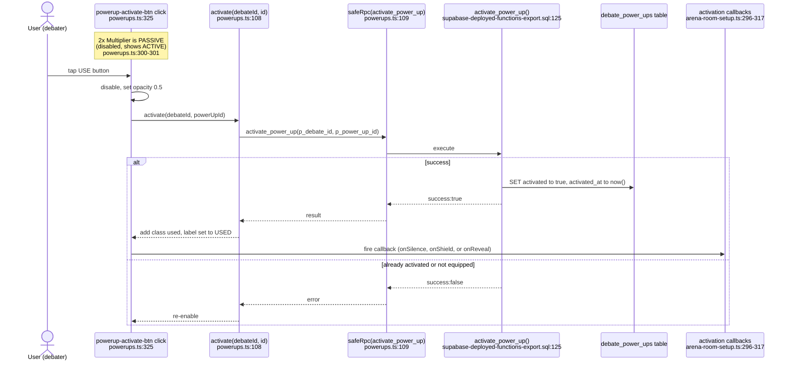
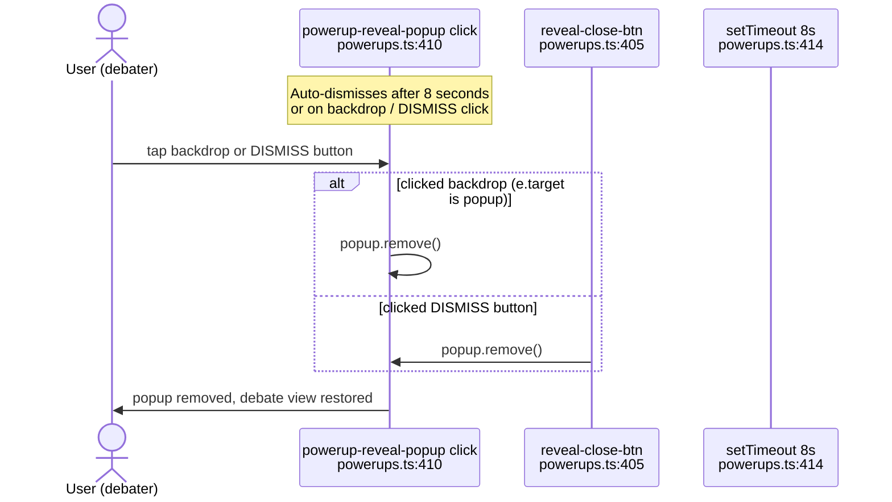
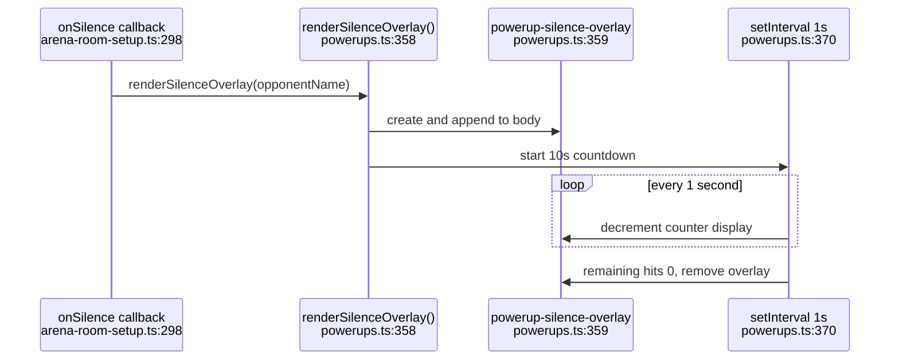
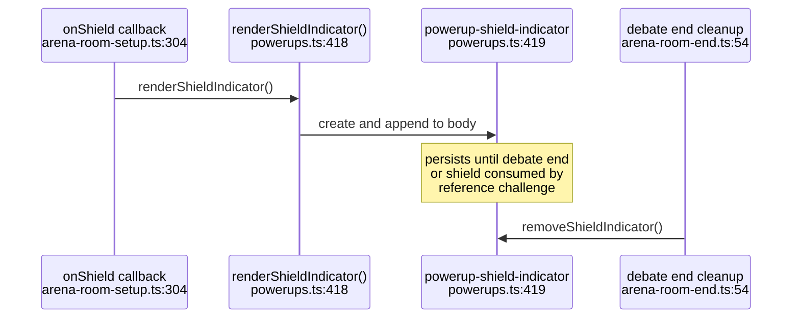

# F-51 — Power-Up Shop — Interaction Map

## Summary

The Power-Up system lets authenticated users spend tokens on four tactical items (2x Multiplier, Silence, Shield, Reveal), equip them into tier-gated slots before a debate, and activate them during live debates for real-time effects. The core module is `src/powerups.ts` (460 lines), which exports the static catalog, five RPC wrappers, three render functions (shop, loadout, activation bar), two wiring functions, and four visual-effect helpers. The shop UI is rendered by `showPowerUpShop()` in `src/arena/arena-lobby.ts:302-349`. The pre-debate loadout and in-debate activation bar are wired by `src/arena/arena-room-setup.ts`. Five backend RPCs (`buy_power_up`, `equip_power_up`, `activate_power_up`, `get_my_power_ups`, `get_opponent_power_ups`) handle all server mutations across three tables (`power_ups`, `user_power_ups`, `debate_power_ups`). Originally tracked as F-10 in the punch list; reassigned to F-51 in the S259 audit to separate it from the superseded S182 modifier design.

## Backend surface

**RPCs:**
- `buy_power_up(p_power_up_id text, p_quantity integer DEFAULT 1)` — `supabase-deployed-functions-export.sql:610`. Tier-gates each power-up (25/50/75/100 questions), deducts token_balance, upserts into user_power_ups, creates a notification.
- `equip_power_up(p_debate_id uuid, p_power_up_id text, p_slot_number integer)` — `supabase-deployed-functions-export.sql:3982`. Validates tier slot count, checks ownership, verifies debate is not yet started, decrements inventory, upserts into debate_power_ups.
- `activate_power_up(p_debate_id uuid, p_power_up_id text)` — `supabase-deployed-functions-export.sql:125`. Sets activated=true and activated_at=now() on the debate_power_ups row. Returns error if not equipped or already activated.
- `get_my_power_ups(p_debate_id uuid DEFAULT NULL)` — `supabase-deployed-functions-export.sql:5699`. Returns inventory (with catalog details) and equipped list for a debate. Also returns questions_answered for tier gating.
- `get_opponent_power_ups(p_debate_id uuid)` — `supabase-deployed-functions-export.sql:5839`. Returns opponent's equipped power-ups for a debate. Used by the Reveal power-up.

**Tables:**
- `power_ups` — catalog (id, name, icon, description, cost, effect_type)
- `user_power_ups` — inventory (user_id, power_up_id, quantity). Composite PK on (user_id, power_up_id).
- `debate_power_ups` — equipped per debate (debate_id, user_id, power_up_id, slot_number, activated, activated_at). Composite unique on (debate_id, user_id, slot_number).
- `profiles` — token_balance read and written by buy_power_up

## Files touched

- `index.html:312` (power-up shop link in profile section)
- `moderator-feed-table-migration.sql:40,46` (defines power_up event type in debate_feed_events)
- `session-232-depth-rewards.sql` (claim_section_reward RPC grants free power-ups on section completion — cross-feature with profile depth)
- `session-236-phase3-references.sql:391-415` (shield power-up check in reference challenge RPC)
- `session-252-f55-overhaul.sql:953-992` (shield power-up check in F-55 reference challenge RPC)
- `src/arena.ts:30,48,59` (re-exports PowerUpEquipped type, activatedPowerUps state, showPowerUpShop)
- `src/arena/arena-core.ts:26,105-107` (imports showPowerUpShop, auto-opens shop if ?shop=1 in URL)
- `src/arena/arena-css.ts:549-551` (feed-evt-powerup styling for power-up activation events in feed)
- `src/arena/arena-feed-room.ts:326-332` (renders power_up event type in debate feed)
- `src/arena/arena-lobby.ts:6-7,121,302-349` (F-51 shop entry, rendering, buy wiring)
- `src/arena/arena-mod-refs.ts:14` (imports removeShieldIndicator for shield cleanup)
- `src/arena/arena-room-end.ts:9,54-60,200-206` (power-up cleanup on debate end)
- `src/arena/arena-room-setup.ts:9-13,93-138,224,250-317` (loadout render, activation bar, wiring)
- `src/arena/arena-state.ts:6,54-58,125,205-209` (activatedPowerUps set, shieldActive flag, equippedForDebate, cleanup)
- `src/arena/arena-types.ts` (EquippedItem type referenced)
- `src/notifications.ts:27,63,71` (power_up notification type, icon, and rendering)
- `src/pages/home.ts:35,361-363` (power-up shop link handler in home profile section)
- `src/pages/profile-depth.ts:52,90-319,712-717` (section reward type definitions and claim_section_reward call — cross-feature)
- `src/pages/spectate.ts:67-72,104,609-678` (replay power-up timeline rendering in spectate view)
- `src/powerups.ts` (entire file is F-51)
- `src/tiers.ts:92-93,165` (getPowerUpSlots — tier-based slot count)
- `supabase-deployed-functions-export.sql:125-155,610-692,3982-4064,5699-5740,5839-5890` (all 5 RPCs)

## User actions in this feature

1. **Enter the power-up shop** — arena lobby shop button or home profile link
2. **Purchase a power-up** — buy button in shop
3. **Exit the power-up shop** — back button returns to lobby
4. **Select an equip slot** — empty slot click in pre-debate loadout
5. **Choose an inventory item to equip** — inventory picker item click
6. **Activate a power-up during debate** — activation bar button tap
7. **Dismiss the reveal popup** — popup backdrop or close button
8. **Enter shop via home profile link** — alternative entry point from index.html

## System actions

9. **Silence overlay countdown** — 10-second timer after Silence activation
10. **Shield indicator display** — badge shown when Shield is active

---

## 1. Enter the power-up shop

**Initiator:** Authenticated user (any role)

The power-up shop button at `arena-lobby.ts:121` listens for clicks on `#arena-powerup-shop-btn`. On click, `showPowerUpShop()` at `arena-lobby.ts:302` checks authentication (redirects to Plinko if not logged in), sets the arena view to `powerUpShop`, reads the user's `token_balance` from the current profile, and calls `renderShop(tokenBalance)` from `powerups.ts:142` to generate the shop HTML. The shop HTML is injected into the screen element along with a BACK button.

<!-- captured: src/arena/arena-lobby.ts:121 -->



**Notes:**
- captured: src/arena/arena-lobby.ts:121 — `#arena-powerup-shop-btn` click handler calls `showPowerUpShop()`.
- The shop also auto-opens if the URL contains `?shop=1`, handled at `arena-core.ts:105-107`.
- Token balance is read from the profile object in memory, not from a fresh RPC call. If the balance is stale (e.g., after a background purchase), the shop may show incorrect afford/disabled states until re-rendered.
- The `CATALOG` constant at `powerups.ts:69-74` defines four power-ups: multiplier_2x (15 tokens), silence (20 tokens), shield (25 tokens), reveal (10 tokens).

---

## 2. Purchase a power-up

**Initiator:** Authenticated user (any role)

Each shop item renders a `.powerup-buy-btn` button with `data-id` and `data-cost` attributes. The buy wiring at `arena-lobby.ts:332-348` attaches click handlers to each button. On click, the handler disables the button, calls `buyPowerUp(id, 1, cost)` (imported as `buy` from `powerups.ts:81`), which performs a client-side balance check before calling `safeRpc('buy_power_up', ...)`. The server-side RPC at `supabase-deployed-functions-export.sql:610` validates tier eligibility (25/50/75/100 questions answered), checks balance, deducts tokens, upserts inventory, and creates a notification. On success, the shop re-renders via `showPowerUpShop()` to refresh the balance display.

<!-- captured: src/arena/arena-lobby.ts:334 -->



**Notes:**
- captured: src/arena/arena-lobby.ts:334 — `buttonEl` click handler fires `buyPowerUp(id, 1, cost)`.
- Tier gate thresholds: multiplier_2x at 25 questions, silence at 50, shield at 75, reveal at 100 (`supabase-deployed-functions-export.sql:636-640`).
- The client-side balance check at `powerups.ts:83-86` is a fast-fail optimization; the server checks balance independently.
- On success, the entire shop re-renders by calling `showPowerUpShop()` again at `arena-lobby.ts:341`, which fetches a fresh profile to update the balance display.
- On failure, the button re-enables and restores its cost text at `arena-lobby.ts:345-346`.

---

## 3. Exit the power-up shop

**Initiator:** Authenticated user (any role)

The BACK button at `arena-lobby.ts:327` calls `renderLobby()` to return to the arena lobby. This replaces the shop HTML with the full lobby render.

<!-- captured: src/arena/arena-lobby.ts:327 -->



**Notes:**
- captured: src/arena/arena-lobby.ts:327 — `#powerup-shop-back` click handler calls `renderLobby()`.
- The back button is a plain text "arrow BACK" element, not a browser history pop. Arena state uses `pushArenaState('powerUpShop')` at `arena-lobby.ts:308`, so the browser back button also works to exit the shop.

---

## 4. Select an equip slot

**Initiator:** Authenticated user (any role, tier-gated)

The pre-debate loadout panel renders during room setup at `arena-room-setup.ts:250-262`. `getMyPowerUps(debateId)` fetches inventory and equipped state. `renderLoadout()` at `powerups.ts:172` generates slot HTML based on the user's tier (0-3 slots from `getPowerUpSlots()` at `tiers.ts:93`). Empty slots render with `cursor:pointer` and class `powerup-slot empty`. `wireLoadout()` at `powerups.ts:248` attaches click handlers to empty slots. On click, the handler stores the selected slot number, shows the inventory picker, and highlights the selected slot.

<!-- captured: src/powerups.ts:252 -->



**Notes:**
- captured: src/powerups.ts:252 — `.powerup-slot.empty` click handler in `wireLoadout()`.
- Tier-based slot counts: 0 questions = 0 slots (locked), Iron tier = 1 slot, Bronze = 2 slots, Silver/Gold = 3 slots. The exact thresholds are defined in `tiers.ts:93`.
- If the user has 0 slots, `renderLoadout()` returns a locked message with the remaining question count at `powerups.ts:182-188`.
- Filled slots (class `powerup-slot filled`) have `cursor:default` and NO click handler. Unequipping is not implemented.
- The inventory picker at `powerups.ts:235` is hidden by default (`display:none`) and only shown on slot click.

---

## 5. Choose an inventory item to equip

**Initiator:** Authenticated user (any role, with inventory)

After selecting a slot (Action 4), the inventory picker shows owned power-ups with quantities. Each `.powerup-inv-item` has a click handler wired at `powerups.ts:263`. On click, if a slot is selected, the handler disables the item, calls `equip(debateId, powerUpId, selectedSlot)` at `powerups.ts:97`, which calls `safeRpc('equip_power_up', ...)`. The server validates slot count, ownership, and debate state (must be pre-start). On success, inventory quantity is decremented and the loadout re-renders via the `onEquipped` callback.

<!-- captured: src/powerups.ts:264 -->



**Notes:**
- captured: src/powerups.ts:264 — `.powerup-inv-item` click handler in `wireLoadout()`.
- If the inventory is empty, the picker shows a "No power-ups owned" message with a link to the shop (`.powerup-open-shop`) at `powerups.ts:237`.
- The `equip_power_up` RPC checks `debate.status` and rejects if the debate has already started (`supabase-deployed-functions-export.sql:4046-4048`).
- The `onEquipped` callback at `arena-room-setup.ts:261-263` refreshes the loadout by calling `getMyPowerUps()` again and re-rendering.

---

## 6. Activate a power-up during debate

**Initiator:** Authenticated debater (either side)

When a debate starts (not Unplugged ruleset), `arena-room-setup.ts:284-317` loads equipped power-ups via `getMyPowerUps()`, renders the activation bar via `renderActivationBar()` at `powerups.ts:295`, and wires it via `wireActivationBar()` at `powerups.ts:323`. Each non-passive, non-used `.powerup-activate-btn` gets a click handler. On click, the handler disables the button, calls `activate(debateId, powerUpId)` at `powerups.ts:108`, which calls `safeRpc('activate_power_up', ...)`. On success, the button shows "USED" and the appropriate callback fires (onSilence, onShield, onReveal).

<!-- captured: src/powerups.ts:325 -->



**Notes:**
- captured: src/powerups.ts:325 — `.powerup-activate-btn:not(.passive):not(.used)` click handler in `wireActivationBar()`.
- The 2x Multiplier (`multiplier_2x`) is passive — its button renders disabled with "ACTIVE" text and `title="Active - doubles staking payout"` at `powerups.ts:300-305`.
- Activation callbacks at `arena-room-setup.ts:296-317`: Silence renders the overlay (Action 9), Shield renders the indicator badge (Action 10), Reveal calls `getOpponentPowerUps()` and renders the popup.
- The activation bar is hidden in Unplugged ruleset debates. The loadout container has `display:none` when `isUnplugged` at `arena-room-setup.ts:224`.

---

## 7. Dismiss the reveal popup

**Initiator:** Authenticated debater (either side)

When the Reveal power-up is activated, `renderRevealPopup()` at `powerups.ts:384` creates a fixed-position overlay showing the opponent's equipped power-ups. The popup has a click handler at `powerups.ts:410` that dismisses it when clicking the backdrop or the DISMISS button. An auto-dismiss `setTimeout` at `powerups.ts:414` removes the popup after 8 seconds.

<!-- captured: src/powerups.ts:410 -->



**Notes:**
- captured: src/powerups.ts:410 — popup click handler checks `e.target === popup` or `e.target.id === 'reveal-close-btn'`.
- The popup first calls `getOpponentPowerUps(debateId)` at `arena-room-setup.ts:311` before rendering. If the opponent has no equipped power-ups, the popup shows "No power-ups equipped."
- The 8-second auto-dismiss at `powerups.ts:414` fires regardless of user interaction. If the user dismisses early, the `setTimeout` callback calls `remove()` on an already-removed element, which is a no-op.

---

## 8. Enter shop via home profile link

**Initiator:** Authenticated user (any role)

The home page profile section in `index.html:312` includes a power-up shop link (`data-action="powerup-shop"`). The click handler at `home.ts:361` calls `navigateTo('arena')` and then `showPowerUpShop()` after a 300ms delay at `home.ts:363`. This provides an alternative entry to the shop without first visiting the arena lobby.

```mermaid
sequenceDiagram
    actor User as User (authenticated)
    participant Link as powerup-shop link<br/>index.html:312
    participant Handler as data-action handler<br/>home.ts:361
    participant NavFn as navigateTo(arena)<br/>home.ts:362
    participant ShopFn as showPowerUpShop()<br/>home.ts:363

    Note over Link: NO DISABLED-STATE LOGIC<br/>always visible in profile section
    User->>Link: tap Power-Up Shop link
    Link->>Handler: data-action is powerup-shop
    Handler->>NavFn: navigateTo(arena)
    Handler->>Handler: setTimeout 300ms
    Handler->>ShopFn: showPowerUpShop()
    ShopFn->>User: power-up shop displayed
```

**Notes:**
- The 300ms delay at `home.ts:363` allows the arena page to render before the shop overlay is injected. This is a timing hack, not a guaranteed sequence.
- The `?shop=1` URL parameter at `arena-core.ts:105-107` provides a third entry path (direct URL), which auto-opens the shop on arena load.

---

## 9. Silence overlay countdown

_C-2 exemption: system_action — no user-initiated trigger; this is a timed visual effect triggered by the Silence activation callback._

After a debater activates the Silence power-up (Action 6), the `onSilence` callback at `arena-room-setup.ts:298-303` calls `renderSilenceOverlay()` at `powerups.ts:358`. This creates a fixed-position banner showing the opponent's name with a 10-second countdown. A `setInterval` at `powerups.ts:370` decrements the counter every second and removes the overlay when it reaches 0.



**Notes:**
- The `setInterval` ID is returned by `renderSilenceOverlay()` for cleanup, stored via the arena state module.
- Cleanup on debate end: `arena-room-end.ts:59` and `arena-room-end.ts:205` remove the overlay element. The `activatedPowerUps` set is cleared at `arena-room-end.ts:58` and `arena-room-end.ts:204`.

---

## 10. Shield indicator display

_C-2 exemption: system_action — no user-initiated trigger; this is a passive visual indicator activated by the Shield activation callback._

After a debater activates the Shield power-up (Action 6), the `onShield` callback at `arena-room-setup.ts:304-308` calls `renderShieldIndicator()` at `powerups.ts:418`. This creates a fixed-position badge at the top-right of the screen reading "SHIELD ACTIVE." The badge persists until `removeShieldIndicator()` is called on debate end or when a reference challenge consumes the shield.



**Notes:**
- Shield consumption by reference challenge is handled in `supabase-deployed-functions-export.sql:1160-1199` — when a reference challenge targets a shielded debater, the server sets `activated=false` on the shield row and inserts a `power_up` feed event. The client-side `removeShieldIndicator()` is called from `arena-room-end.ts`.
- The badge element reference is returned by `renderShieldIndicator()` for direct cleanup.

---

## Cross-references

- [F-01 Queue/Matchmaking](./F-01-queue-matchmaking.md) — shares `src/arena/arena-lobby.ts`. The ENTER THE ARENA button and POWER-UP SHOP button live in the same lobby. F-01 handles matchmaking; F-51 handles the shop overlay within the same lobby view.
- [F-09 Token Staking](./F-09-token-staking.md) — `buy_power_up` deducts from the same `token_balance` column that staking uses. The 2x Multiplier power-up doubles staking payout, creating a direct gameplay interaction between F-09 and F-51.
- [F-46 Private Lobby](./F-46-private-lobby.md) — shares `src/arena/arena-lobby.ts`. The private debate button and power-up shop button coexist in the lobby. Both push arena history state.
- [F-47 Moderator Marketplace](./F-47-moderator-marketplace.md) — shares `src/arena/arena-lobby.ts`. The MOD QUEUE button is adjacent to the shop button in the lobby.
- [F-50 Moderator Discovery](./F-50-moderator-discovery.md) — shares `src/arena/arena-lobby.ts` for the moderator recruitment banner.
- Profile Depth (no F-map yet) — `claim_section_reward` at `session-232-depth-rewards.sql:42` grants free power-ups on section completion, cross-referencing `src/pages/profile-depth.ts:712`. The trigger is in profile depth; the inventory write is in `user_power_ups`.

## Known quirks

- **Unequip not implemented.** Filled slots at `powerups.ts:204` render with `cursor:default` and no click handler. Once a power-up is equipped for a debate, it cannot be removed or swapped. The `equip_power_up` RPC does support replacing a slot (ON CONFLICT DO UPDATE at `supabase-deployed-functions-export.sql:4058-4060`), but the client provides no UI for it.
- **LM-176: activate_power_up dual-flag issue.** The `debate_power_ups` table has both `activated` (boolean) and `activated_at` (timestamp). The RPC at `supabase-deployed-functions-export.sql:151` sets both, but the original Session 118 version only set `activated_at`. If the LM-176 fix was not applied, `get_my_power_ups` returns activated=false even after activation.
- **Client balance staleness.** `showPowerUpShop()` reads `token_balance` from `getCurrentProfile()` at `arena-lobby.ts:309`. If the balance changed server-side (e.g., from another tab or a concurrent staking payout), the shop may show items as affordable when they are not. The server-side check in `buy_power_up` prevents overspend.
- **300ms timing hack for home entry.** The home profile link handler at `home.ts:363` uses `setTimeout(showPowerUpShop, 300)` to wait for the arena page to render. On slow devices, this may fire before the screen element exists, causing the shop to not render.
- **Reveal popup double-cleanup.** The auto-dismiss `setTimeout(8000)` at `powerups.ts:414` fires even if the user dismissed the popup manually. The second `remove()` call is a harmless no-op but indicates the lack of a cleanup guard.
- **Activation bar hidden in Unplugged.** The loadout container at `arena-room-setup.ts:224` has `display:none` for Unplugged ruleset debates. Power-ups are unavailable in Unplugged mode by UI suppression, not server enforcement.
